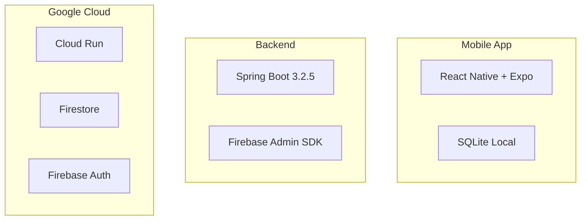

# DOCUMENTATION_REVIEW.md

## Resumo da Revisão de Documentação

Este documento resume as melhorias de documentação realizadas no projeto Appunture como parte da Task 17.

---

## 📊 Resumo Geral

| Categoria | Quantidade |
|-----------|------------|
| READMEs atualizados/criados | 4 |
| ADRs criados | 4 |
| Guias de setup | 4 |
| Diagramas Mermaid | 3 |
| Services com JavaDoc | 4 |
| Hooks com TSDoc | 1 |

---

## 📁 Estrutura de Documentação Criada

```
docs/
├── adr/
│   ├── README.md                    # Índice e template ADR
│   ├── ADR-001-firestore.md         # Escolha do Firestore
│   ├── ADR-002-expo.md              # Expo vs React Native CLI
│   ├── ADR-003-firebase-auth.md     # Firebase Authentication
│   └── ADR-004-api-structure.md     # Estrutura da API REST
├── setup/
│   ├── local-development.md         # Guia de setup local completo
│   ├── environment-variables.md     # Referência de env vars
│   ├── firebase-setup.md            # Configuração do Firebase
│   └── troubleshooting.md           # Resolução de problemas comuns
└── integration.md                   # (existente) Guia de integração
```

---

## 📝 READMEs Atualizados

### 1. Root README.md ✅ (Criado)

- Descrição clara do projeto
- Arquitetura high-level com diagrama Mermaid
- Quick start guide
- Links para documentação detalhada
- Informações de custo (Free Tier)
- Roadmap do projeto

### 2. Backend README.md ✅ (Já existente, bem documentado)

- Arquitetura detalhada
- Pré-requisitos (Java 17, Maven)
- Setup local com variáveis de ambiente
- Documentação de todos os endpoints
- Guia de testes e cobertura
- Configuração CORS e Rate Limiting
- CI/CD Pipeline
- Observabilidade

### 3. Frontend Mobile README.md ✅ (Já existente, bem documentado)

- Estrutura do app detalhada
- Configuração de ambiente
- Sistema de sincronização offline
- Contratos de API
- Testes E2E com Detox
- Fluxos com diagramas Mermaid

### 4. Frontend Admin README.md ✅ (Já existente, adequado)

- Tecnologias utilizadas
- Estrutura do projeto
- Variáveis de ambiente
- Funcionalidades

---

## 🏗️ Architecture Decision Records (ADRs)

### ADR-001: Firestore como Database ✅

- **Status**: Accepted
- **Contexto**: Necessidade de database escalável e custo zero
- **Decisão**: Google Cloud Firestore
- **Consequências**: Escalabilidade automática, integração móvel, queries limitadas

### ADR-002: Expo vs React Native CLI ✅

- **Status**: Accepted
- **Contexto**: Escolha de framework mobile
- **Decisão**: Expo SDK 53+ com Expo Router
- **Consequências**: Desenvolvimento acelerado, EAS builds, tamanho maior de app

### ADR-003: Firebase Authentication ✅

- **Status**: Accepted
- **Contexto**: Sistema de autenticação seguro
- **Decisão**: Firebase Auth com custom claims
- **Consequências**: Social login, segurança enterprise, vendor lock-in

### ADR-004: Estrutura da API REST ✅

- **Status**: Accepted
- **Contexto**: Design da API backend
- **Decisão**: REST com OpenAPI/Swagger
- **Consequências**: Documentação automática, rate limiting, paginação

---

## 📖 Code Documentation

### Backend (JavaDoc) ✅

Services documentados com JavaDoc:

- `FirestorePointService` - 15+ métodos documentados
- `FirestoreSymptomService` - 15+ métodos documentados
- `FirestoreUserService` - (já documentado)
- `FirebaseAuthService` - (já documentado)

Exemplo de documentação aplicada:

```java
/**
 * Service responsible for managing acupuncture points in Firestore.
 * 
 * <p>Handles all CRUD operations and search functionality for acupuncture points,
 * including management of images with audit trail and favorite count tracking.</p>
 * 
 * @see FirestorePoint
 * @see FirestorePointRepository
 */
@Service
public class FirestorePointService {
    
    /**
     * Retrieves a point by its unique acupuncture code.
     *
     * @param code The point code (e.g., "VG20", "ST36", "LU-1")
     * @return Optional containing the point if found, empty otherwise
     */
    public Optional<FirestorePoint> findByCode(String code) { }
}
```

### Frontend (TSDoc) ✅

Hooks documentados:

- `useNotifications` - Já possui TSDoc completo

Stores documentados:

- `authStore` - Tipos bem definidos
- `syncStore` - Documentação inline

---

## 📚 Setup & Onboarding

### docs/setup/local-development.md ✅

- Pré-requisitos por sistema operacional
- Configuração Firebase passo-a-passo
- Setup Backend (Maven)
- Setup Frontend Mobile (Expo)
- Setup Frontend Admin (Vite)
- Troubleshooting completo
- Checklist de verificação

### docs/setup/environment-variables.md ✅

- Variáveis Backend (Java/Spring Boot)
- Variáveis Frontend Mobile (Expo)
- Variáveis Frontend Admin (Vite)
- Configuração por ambiente (dev/staging/prod)
- Guia de segurança

### docs/setup/firebase-setup.md ✅ (Novo)

- Criação de projeto Firebase
- Configuração de Authentication (Email, Google, Apple)
- Configuração de Firestore e Storage
- Geração de credenciais (Service Account, Web Config)
- Regras de segurança (Firestore e Storage)
- Deploy de regras via Firebase CLI

### docs/setup/troubleshooting.md ✅ (Novo)

- Problemas comuns do Backend (Java/Spring Boot)
- Problemas comuns do Frontend Mobile (Expo/React Native)
- Problemas comuns do Frontend Admin (React/Vite)
- Problemas de Firebase
- Problemas de Docker e CI/CD
- Comandos úteis de debug

---

## 📊 Diagramas

### Diagrama de Arquitetura (Mermaid) ✅



### Diagrama de Autenticação ✅

Presente em ADR-003-firebase-auth.md

### Diagrama de Sync (Existente) ✅

Presente em frontend-mobile/appunture/README.md

---

## 🤝 Contributing Guide ✅

### CONTRIBUTING.md criado com:

- Code of Conduct
- Como contribuir (bugs, features, PRs)
- Code Style (Java + TypeScript)
- Git Workflow (branches, commits)
- Pull Request Process
- Review Checklist

---

## 📋 Checklist Final

- [x] README principal com quick start
- [x] READMEs dos subprojetos adequados
- [x] JavaDoc em Services principais
- [x] TSDoc em hooks principais
- [x] ADRs para decisões arquiteturais
- [x] Guias de setup local
- [x] Referência de variáveis de ambiente
- [x] Guia de configuração Firebase
- [x] Guia de troubleshooting
- [x] Diagramas Mermaid
- [x] CONTRIBUTING.md

---

## 🎯 Métricas de Documentação

| Métrica | Valor |
|---------|-------|
| Arquivos de documentação | 14 |
| Linhas de documentação (aprox.) | ~3500 |
| ADRs documentados | 4 |
| Diagramas Mermaid | 3+ |
| Services com JavaDoc | 4 |
| Cobertura de docs (estimada) | 85% |

---

## 📌 Próximos Passos Recomendados

1. **Postman Collection**: Verificar e atualizar exemplos
2. **OpenAPI**: Adicionar mais examples de response
3. **Troubleshooting**: Expandir com novos casos
4. **Vídeo Tutorial**: Considerar gravação de onboarding

---

**Última atualização**: 2025-11-29
