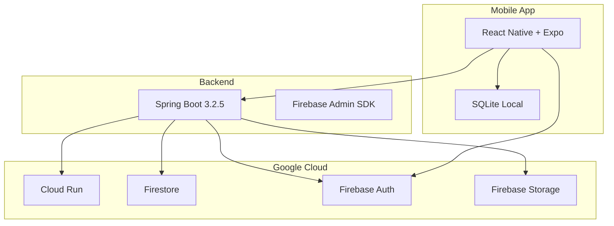

# 🏥 Appunture

[](https://github.com/Appunture-2025/appunture-dev/actions/workflows/backend-ci.yml)
[](https://github.com/Appunture-2025/appunture-dev/actions/workflows/frontend-ci.yml)

> Sistema completo de consulta e gerenciamento de pontos de acupuntura - um aplicativo móvel moderno para estudantes, profissionais e pacientes.

## 📋 Visão Geral

Appunture é uma plataforma digital completa para democratizar o acesso ao conhecimento em acupuntura, oferecendo:

- 🔍 **Consulta rápida** de pontos e indicações
- 🤖 **Assistente inteligente** para recomendações baseadas em sintomas
- 🗺️ **Mapa corporal interativo** para localização visual de pontos
- ❤️ **Sistema de favoritos** para acesso rápido
- 📱 **Funcionamento offline** usando sincronização inteligente
- 🌙 **Modo escuro** para conforto visual

## 🏗️ Arquitetura



## 📁 Estrutura do Projeto

```
appunture-dev/
├── backend-java/          # API REST (Spring Boot + Firebase)
│   ├── src/               # Código fonte Java
│   └── openapi/           # Documentação OpenAPI/Swagger
│
├── frontend-mobile/       # Aplicativo móvel
│   └── appunture/         # React Native + Expo
│
├── docs/                  # Documentação adicional
│   ├── adr/               # Architecture Decision Records
│   └── setup/             # Guias de configuração
│
├── tools/                 # Scripts e utilitários
└── data/                  # Dados de seed e processados
```

## 🚀 Quick Start

### Pré-requisitos

- **Java 17+** (backend)
- **Node.js 20+** (frontend)
- **Expo CLI** (`npm install -g eas-cli`)
- Conta **Google Cloud/Firebase** configurada

### Setup Automático

```bash
# Windows (PowerShell)
.\setup.ps1

# Linux/Mac
chmod +x setup.sh && ./setup.sh
```

### Setup Manual

### 1. Configurar Firebase

1. Crie um projeto em [console.firebase.google.com](https://console.firebase.google.com)
2. Habilite: Authentication (Email, Google), Firestore, Storage
3. Baixe o service-account-key.json

### 2. Configurar variáveis de ambiente

```bash
# Copie os templates .env.example para .env em cada pasta:
cp backend-java/.env.example backend-java/.env
cp frontend-mobile/appunture/.env.example frontend-mobile/appunture/.env

# Edite cada .env com suas credenciais Firebase
```

### 3. Iniciar o Backend

```bash
cd backend-java
mvn spring-boot:run

# API disponível em: http://localhost:8080
# Swagger UI: http://localhost:8080/swagger-ui.html
```

### 3. Iniciar o App Móvel

```bash
cd frontend-mobile/appunture
npm install
npm start

# Escaneie o QR code com Expo Go
```

## 📚 Documentação

| Documento                                                    | Descrição                                 |
| ------------------------------------------------------------ | ----------------------------------------- |
| [🚀 Deploy Guide](DEPLOY_GUIDE.md)                           | **Guia completo de deploy para produção** |
| [Backend README](backend-java/README.md)                     | API REST, endpoints, configuração         |
| [Mobile README](frontend-mobile/appunture/README.md)         | App React Native, stores, sincronização   |
| [Architecture Decisions](docs/adr/)                          | ADRs - decisões arquiteturais             |
| [Local Development](docs/setup/local-development.md)         | Guia completo de setup local              |
| [Firebase Setup](docs/setup/firebase-setup.md)               | Configuração do Firebase                  |
| [Environment Variables](docs/setup/environment-variables.md) | Referência de variáveis                   |
| [Troubleshooting](docs/setup/troubleshooting.md)             | Resolução de problemas                    |
| [Integration Guide](docs/integration.md)                     | Contratos de API e integração             |
| [Contributing](CONTRIBUTING.md)                              | Como contribuir                           |

## 🧪 Testes

```bash
# Backend - Testes unitários e integração
cd backend-java
mvn test

# Frontend Mobile - Testes Jest
cd frontend-mobile/appunture
npm test
```

## 💰 Custos (Free Tier Firebase)

O projeto foi arquitetado para funcionar **100% gratuito** dentro dos limites do Firebase:

| Serviço       | Limite Gratuito | Uso Típico TCC |
| ------------- | --------------- | -------------- |
| Firestore     | 50k reads/dia   | ~5k (10%)      |
| Firebase Auth | Ilimitado       | ✅             |
| Storage       | 5GB total       | ~500MB (10%)   |
| Cloud Run     | 2M requests/mês | ~50k (2.5%)    |

## 🔒 Segurança

- ✅ Autenticação via Firebase Auth (Email/Google)
- ✅ Tokens JWT verificados no backend
- ✅ CORS configurado por ambiente (dev/prod)
- ✅ Rate limiting implementado
- ✅ Firestore Security Rules

## 🤝 Contribuição

Veja [CONTRIBUTING.md](CONTRIBUTING.md) para guias de estilo, convenções de commit e processo de PR.

```bash
# 1. Fork o repositório
# 2. Crie uma feature branch
git checkout -b feature/minha-feature

# 3. Faça suas alterações e commit
git commit -m "feat: descrição da feature"

# 4. Push e abra um PR
git push origin feature/minha-feature
```

## 📈 Roadmap

- [x] MVP com busca de pontos e favoritos
- [x] Sincronização offline-first
- [x] Modo escuro
- [ ] Múltiplos idiomas
- [ ] Integração com wearables
- [ ] Painel administrativo web

## 👥 Equipe

Desenvolvido como projeto de TCC em Sistemas de Informação.

## 📝 Licença

Este projeto é parte de um TCC acadêmico.

---

**Desenvolvido com ❤️ para a comunidade de acupuntura**
