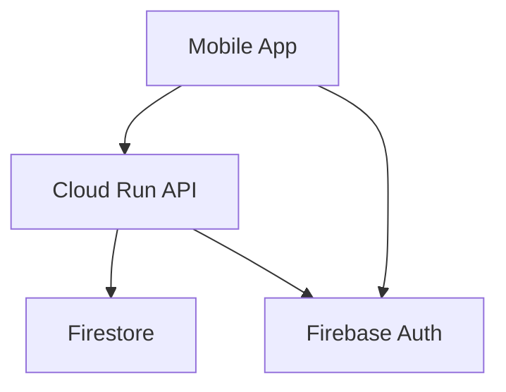

# Task 17: Documentation Review & Improvement

## Objetivo

Revisar e melhorar toda a documentação do projeto, garantindo que novos desenvolvedores possam contribuir facilmente.

## Escopo

### 1. README Files

#### Root README.md

- [ ] Descrição clara do projeto
- [ ] Arquitetura high-level
- [ ] Quick start guide
- [ ] Links para docs detalhados

#### Backend README.md (`backend-java/`)

- [ ] Pré-requisitos (Java 21, Maven, etc)
- [ ] Setup local
- [ ] Variáveis de ambiente
- [ ] Comandos úteis
- [ ] Deploy instructions

#### Frontend README.md (`frontend-mobile/appunture/`)

- [ ] Pré-requisitos (Node, Expo CLI)
- [ ] Setup local
- [ ] Estrutura de pastas
- [ ] Comandos úteis
- [ ] Build/Deploy

#### Admin README.md (`frontend-admin/`)

- [ ] Setup local
- [ ] Estrutura de pastas
- [ ] Build/Deploy

### 2. Code Documentation

#### Backend (JavaDoc)

- [ ] Todos os Services documentados
- [ ] DTOs com descrição de campos
- [ ] Controllers com descrição de endpoints
- [ ] Exceptions documentadas

```java
/**
 * Service responsible for managing acupuncture points.
 * Handles CRUD operations and search functionality.
 *
 * @see Point
 * @see PointDTO
 */
@Service
public class PointService {

    /**
     * Retrieves a point by its unique code.
     *
     * @param code The point code (e.g., "LU-1", "ST-36")
     * @return The point entity
     * @throws ResourceNotFoundException if point not found
     */
    public Point getByCode(String code) { ... }
}
```

#### Frontend (JSDoc/TSDoc)

- [ ] Hooks documentados
- [ ] Componentes com props description
- [ ] Services documentados
- [ ] Types com descrições

````typescript
/**
 * Hook for managing user favorites.
 * Provides methods to add/remove favorites and check favorite status.
 *
 * @example
 * ```tsx
 * const { favorites, addFavorite, removeFavorite, isFavorite } = useFavorites();
 * ```
 */
export function useFavorites() { ... }
````

### 3. Architecture Documentation

#### ADR (Architecture Decision Records)

- [ ] Criar `docs/adr/` com decisões arquiteturais
- [ ] ADR-001: Escolha do Firestore
- [ ] ADR-002: Expo vs React Native CLI
- [ ] ADR-003: Firebase Auth
- [ ] ADR-004: Estrutura de API

```markdown
# ADR-001: Firestore como Database

## Status

Accepted

## Context

Precisamos de um database escalável, serverless...

## Decision

Usar Google Cloud Firestore...

## Consequences

- ✅ Escalabilidade automática
- ✅ Integração nativa com Firebase
- ❌ Queries limitadas
```

### 4. API Documentation

#### OpenAPI/Swagger

- [ ] Verificar completude do `openapi/openapi.yaml`
- [ ] Adicionar examples
- [ ] Documentar error responses
- [ ] Gerar HTML com Redoc

#### Postman Collection

- [ ] Verificar `postman/` está atualizada
- [ ] Adicionar examples de response
- [ ] Documentar variáveis

### 5. Contributing Guide

#### CONTRIBUTING.md

- [ ] Code style guide
- [ ] Branch naming convention
- [ ] Commit message format
- [ ] PR template
- [ ] Review checklist

```markdown
# Contributing to Appunture

## Code Style

- Backend: Google Java Style
- Frontend: Prettier + ESLint

## Branch Naming

- feature/xxx
- bugfix/xxx
- hotfix/xxx

## Commit Messages

- feat: new feature
- fix: bug fix
- docs: documentation
- refactor: code refactoring
```

### 6. Setup & Onboarding

#### docs/setup/

- [ ] `local-development.md` - Setup completo
- [ ] `environment-variables.md` - Todas as env vars
- [ ] `firebase-setup.md` - Config Firebase
- [ ] `troubleshooting.md` - Problemas comuns

### 7. Diagrams

#### Criar diagramas com Mermaid

- [ ] Arquitetura do sistema
- [ ] Fluxo de autenticação
- [ ] Data model (ER diagram)
- [ ] Sequence diagrams para flows principais



## Critérios de Aceitação

1. **READMEs Atualizados**:

   - Todos os READMEs com informações completas
   - Quick start funcional
   - Links funcionando

2. **Code Documentation**:

   - Todos os Services/Hooks documentados
   - JSDoc/JavaDoc validado

3. **Architecture Docs**:

   - Mínimo 3 ADRs criados
   - Diagramas de arquitetura

4. **Onboarding**:
   - Novo dev consegue rodar local em 30min
   - Troubleshooting para erros comuns

## Output Esperado

```markdown
# DOCUMENTATION_REVIEW.md

## Resumo

- READMEs atualizados: 4
- ADRs criados: 5
- Diagramas: 3
- Code coverage docs: 85%

## Estrutura de Docs Criada

docs/
├── adr/
│ ├── ADR-001-firestore.md
│ ├── ADR-002-expo.md
│ └── ...
├── setup/
│ ├── local-development.md
│ └── environment-variables.md
├── architecture/
│ ├── system-overview.md
│ └── diagrams/
└── api/
└── openapi.html

## Melhorias Aplicadas

1. README principal com quick start
2. JavaDoc em todos os Services
3. TSDoc nos hooks principais
4. Diagramas Mermaid
```

## Labels

`documentation`, `onboarding`, `copilot-agent`, `priority:low`
