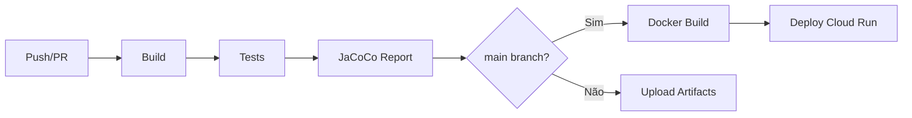

# 🚀 Appunture Backend - Java Spring Boot

[](https://github.com/Appunture-2025/appunture-dev/actions/workflows/backend-ci.yml)
[](#-testes)
[](target/site/jacoco/index.html)

## 📋 Visão Geral

Backend moderno do aplicativo Appunture desenvolvido com **Spring Boot 3.2.5** e **Java 17**, integrado com **Firebase/Google Cloud** para uma arquitetura serverless e otimizada para custos zero durante o desenvolvimento do TCC.

### 🏗️ Arquitetura

```
Firebase Auth + Firestore + Firebase Storage + Cloud Run
├── Spring Boot 3.2.5 (Jakarta EE)
├── Java 17
├── Firebase Admin SDK
├── Google Cloud Firestore (NoSQL)
├── Firebase Storage (Arquivos)
├── MapStruct (DTOs)
└── OpenAPI 3 (Documentação)
```

## ✨ Principais Features

- 🔐 **Autenticação Firebase Auth** - Sistema completo de autenticação
- 🗄️ **Database Firestore** - NoSQL escalável e otimizado para mobile
- 📁 **Firebase Storage** - Upload e gerenciamento de arquivos
- 🌐 **API REST Completa** - CRUD para usuários, pontos e sintomas
- 📚 **Documentação OpenAPI** - Swagger UI integrado
- 🐳 **Containerizada** - Docker otimizado para Cloud Run
- ⚡ **Performance** - Cache in-memory e operações assíncronas
- 🔒 **Segurança** - Role-based access control (RBAC)

## 🚀 Quick Start

### Pré-requisitos

- Java 17+
- Maven 3.8+
- Docker (opcional)
- Conta Google Cloud/Firebase

### 1. Configuração Firebase

1. Crie um projeto no [Firebase Console](https://console.firebase.google.com)
2. Habilite Firebase Auth, Firestore e Storage
3. Baixe o arquivo `service-account-key.json`
4. Configure as variáveis de ambiente:

```bash
export GOOGLE_APPLICATION_CREDENTIALS=/path/to/service-account-key.json
export FIREBASE_PROJECT_ID=seu-project-id
export FIREBASE_STORAGE_BUCKET=seu-project-id.appspot.com
```

### 2. Execução Local

```bash
# Clone o repositório
git clone <repo-url>
cd backend-java

# Execute com Maven
mvn spring-boot:run

# Ou com Docker
docker build -t appunture-backend .
docker run -p 8080:8080 appunture-backend
```

### 3. Acesse a Documentação

- **API Docs**: http://localhost:8080/swagger-ui.html
- **Health Check**: http://localhost:8080/health

## 📁 Estrutura do Projeto

```
src/main/java/com/appunture/backend/
├── config/                 # Configurações
│   ├── FirestoreConfig.java        # Config Firebase/Firestore
│   ├── SecurityConfig.java         # Spring Security
│   └── OpenApiConfig.java          # Swagger/OpenAPI
├── controller/             # Controllers REST
│   ├── FirestoreAuthController.java
│   ├── FirestorePointController.java
│   ├── FirestoreSymptomController.java
│   ├── FirestoreAdminController.java
│   └── FirestoreHealthController.java
├── model/                  # Modelos de dados
│   └── firestore/
│       ├── FirestoreUser.java
│       ├── FirestorePoint.java
│       └── FirestoreSymptom.java
├── repository/             # Repositórios Firestore
│   ├── FirestoreUserRepository.java
│   ├── FirestorePointRepository.java
│   └── FirestoreSymptomRepository.java
├── service/               # Serviços de negócio
│   ├── FirebaseAuthService.java
│   ├── FirestoreUserService.java
│   ├── FirestorePointService.java
│   └── FirestoreSymptomService.java
├── dto/                   # Data Transfer Objects
├── exception/             # Tratamento de exceções
└── util/                  # Utilitários
```

## 🌐 API Endpoints

### 🔐 Autenticação (Firebase ID Token obrigatório)

```
GET    /auth/profile               # Perfil do usuário no Firestore
PUT    /auth/profile               # Atualizar perfil
POST   /auth/sync                  # Sincronizar usuário do Firebase Auth → Firestore
GET    /auth/me                    # Dados do token + perfil
POST   /auth/favorites/{pointId}   # Adicionar favorito
DELETE /auth/favorites/{pointId}   # Remover favorito
```

### 🎯 Pontos de Acupuntura

```
GET    /points             # Listar pontos
GET    /points/{id}        # Buscar ponto por ID Firestore
GET    /points/code/{code} # Buscar ponto por código (ex.: VG20)
GET    /points/meridian/{meridian} # Pontos por meridiano
GET    /points/symptom/{id}    # Pontos associados a um sintoma
POST   /points             # Criar ponto (admin)
PUT    /points/{id}        # Atualizar ponto (admin)
DELETE /points/{id}        # Deletar ponto (admin)
GET    /points/search      # Buscar pontos
GET    /points/popular     # Pontos populares
```

### 🩺 Sintomas

```
GET    /symptoms               # Listar sintomas
GET    /symptoms/{id}          # Buscar sintoma
GET    /symptoms/point/{id}    # Sintomas associados a um ponto
GET    /symptoms/category/{c}  # Sintomas por categoria
GET    /symptoms/tag/{tag}     # Sintomas por tag
GET    /symptoms/severity      # Sintomas por faixa de severidade
GET    /symptoms/popular       # Sintomas mais utilizados
POST   /symptoms           # Criar sintoma (admin)
PUT    /symptoms/{id}      # Atualizar sintoma (admin)
DELETE /symptoms/{id}      # Deletar sintoma (admin)
GET    /symptoms/search    # Buscar sintomas
GET    /symptoms/categories # Categorias de sintomas
```

### 👤 Favoritos

```
Manuseados via /auth/favorites/**
```

### 👨‍💼 Administração

```
GET    /admin/dashboard    # Dashboard admin
GET    /admin/users        # Gerenciar usuários
PUT    /admin/users/{id}/role   # Alterar role
DELETE /admin/users/{id}   # Deletar usuário
GET    /admin/stats        # Estatísticas
POST   /admin/data/seed    # Carregar dados iniciais (seed)
```

### 🏥 Health Checks

```
GET /health               # Status básico
GET /health/detailed      # Status detalhado
GET /health/readiness     # Readiness probe
GET /health/liveness      # Liveness probe
```

## 🌱 Seed Data (Dados Iniciais)

O sistema possui um pipeline completo para geração e importação de dados iniciais de pontos de acupuntura, sintomas e categorias.

### Arquivos de Seed

Os dados de seed estão localizados em `src/main/resources/seed/`:

| Arquivo | Descrição | Registros |
|---------|-----------|-----------|
| `points_seed.ndjson` | Pontos de acupuntura (361 pontos) | ~361 |
| `symptoms_seed.ndjson` | Sintomas extraídos das indicações | ~600+ |
| `categories_seed.ndjson` | Categorias de sintomas | ~13 |

### Pipeline de Geração

Para regenerar os dados de seed a partir dos CSVs fonte:

```bash
# Na raiz do projeto
cd tools

# Executar pipeline completo
./run_seed_pipeline.sh

# Ou executar etapas individuais:
python3 normalize_points.py           # Normaliza CSVs
python3 include_missing_meridians.py  # Adiciona GV/CV
python3 update_*.py                   # Enriquece descrições
python3 validate_points_review.py     # Valida dados
python3 export_points_review.py       # Gera JSON/NDJSON
python3 generate_symptoms_seed.py     # Gera sintomas/categorias
```

### Importação via API (Desenvolvimento)

Para popular o banco com dados iniciais em ambiente de desenvolvimento:

```bash
# 1. Inicie o backend
mvn spring-boot:run

# 2. Obtenha um token de admin do Firebase Auth

# 3. Execute o seed via API
curl -X POST http://localhost:8080/api/admin/data/seed \
  -H "Authorization: Bearer <ADMIN_TOKEN>" \
  -H "Content-Type: application/json"

# 4. Verifique os dados
curl http://localhost:8080/api/points?limit=5
curl http://localhost:8080/api/symptoms?limit=5
```

### Importação via GCP (Produção)

Para importar diretamente no Firestore em produção:

```bash
# 1. Configure as credenciais GCP
export GOOGLE_APPLICATION_CREDENTIALS=/path/to/service-account.json

# 2. Use o gcloud CLI para importar
# Primeiro, faça upload dos arquivos para um bucket GCS
gsutil cp src/main/resources/seed/*.ndjson gs://your-bucket/seed/

# 3. Importe no Firestore
gcloud firestore import gs://your-bucket/seed/

# Alternativa: Use o Firebase CLI
firebase emulators:start --import=./seed-data
```

### Versionamento de Dados

Os dados processados são versionados por data em `data/processed/<YYYY-MM-DD>/`:

```
data/processed/2025-11-28/
├── points_seed.json        # JSON formatado (para revisão)
├── points_seed.ndjson      # NDJSON (para Firestore)
├── points_review.csv       # CSV intermediário
├── symptoms_seed.json      # Sintomas JSON
├── symptoms_seed.ndjson    # Sintomas NDJSON
├── categories_seed.json    # Categorias JSON
└── categories_seed.ndjson  # Categorias NDJSON
```

### Backup

Os CSVs originais são mantidos em `tables/raw/` como backup.

## 🧰 Coleções e Contratos

- **Postman/Insomnia**: importe `backend-java/openapi/appunture-backend.postman_collection.json` (variáveis `baseUrl`, `firebase_id_token` e `admin_id_token` já configuradas).
- **Swagger UI**: disponível em `/swagger-ui.html` com os novos exemplos (`FirestorePoint`, `PointImageRequest`).
- **Observabilidade**: arquivos prontos em `backend-java/observability/` para provisionar Prometheus/Grafana + alertas.

## 🔧 Configuração

### 🔒 Segurança - CORS (Cross-Origin Resource Sharing)

#### ⚠️ CRÍTICO: Configuração Por Ambiente

A aplicação utiliza configuração CORS restritiva por segurança. **NUNCA use `allowedOrigins("*")` em produção!**

**Riscos de CORS Permissivo:**

- CSRF (Cross-Site Request Forgery)
- XSS (Cross-Site Scripting)
- Data leakage
- Acesso não autorizado à API

#### Ambiente de Desenvolvimento (`application-dev.yml`)

Permite apenas localhost e IPs de rede local:

```yaml
app:
  security:
    cors:
      allowed-origin-patterns:
        - http://localhost:*
        - http://127.0.0.1:*
        - http://192.168.*.*
        - http://10.*.*.*
      allow-credentials: true
```

**Uso:**

- Frontend React: `http://localhost:3000`
- Expo Mobile: `http://localhost:19006`
- Testes locais: `http://127.0.0.1:8080`

#### Ambiente de Produção (`application-prod.yml`)

**Apenas domínios HTTPS específicos:**

```yaml
app:
  security:
    cors:
      allowed-origins:
        - https://appunture.com
        - https://app.appunture.com
        - https://admin.appunture.com
        - https://appunture-tcc.web.app
        - https://appunture-tcc.firebaseapp.com
      allow-credentials: true
```

**⚠️ Para adicionar novo domínio em produção:**

1. Edite `application-prod.yml`
2. Adicione domínio HTTPS completo
3. Execute testes CORS
4. Deploy com validação

#### Testando CORS Localmente

```bash
# Dev - Deve PERMITIR localhost
curl -X OPTIONS http://localhost:8080/api/health \
  -H "Origin: http://localhost:3000" \
  -H "Access-Control-Request-Method: GET" \
  -v

# Prod - Deve BLOQUEAR domínios não autorizados
curl -X OPTIONS https://api.appunture.com/api/health \
  -H "Origin: https://evil.com" \
  -H "Access-Control-Request-Method: GET" \
  -v
```

#### Testes Automatizados

Execute os testes de CORS para validar a configuração:

```bash
# Executar testes CORS
mvn test -Dtest=CorsConfigurationTest

# Resultado esperado:
# ✅ Tests run: 8, Failures: 0, Errors: 0
```

### Variáveis de Ambiente

| Variável                         | Descrição                         | Obrigatório |
| -------------------------------- | --------------------------------- | ----------- |
| `GOOGLE_APPLICATION_CREDENTIALS` | Caminho para service account JSON | ✅          |
| `FIREBASE_PROJECT_ID`            | ID do projeto Firebase            | ✅          |
| `FIREBASE_STORAGE_BUCKET`        | Bucket do Firebase Storage        | ✅          |
| `SERVER_PORT`                    | Porta do servidor (padrão: 8080)  | ❌          |
| `LOGGING_LEVEL_ROOT`             | Nível de log (padrão: INFO)       | ❌          |

### application.yml

```yaml
server:
  port: ${SERVER_PORT:8080}

spring:
  application:
    name: appunture-backend
  profiles:
    active: ${SPRING_PROFILES_ACTIVE:dev}

firebase:
  project-id: ${FIREBASE_PROJECT_ID}
  storage-bucket: ${FIREBASE_STORAGE_BUCKET}

logging:
  level:
    com.appunture: DEBUG
    org.springframework.security: DEBUG
```

## 🧪 Testes

```bash
# Executar todos os testes
mvn test

# Executar com coverage e gerar relatório JaCoCo
mvn test jacoco:report

# Visualizar relatório de cobertura (após mvn test)
# Abrir target/site/jacoco/index.html no navegador

# Testes de integração
mvn verify -P integration-tests
```

### Perfil de Teste

Os testes utilizam o perfil `test` configurado em `src/test/resources/application-test.yml`:

- Firebase desabilitado (usa mocks)
- Rate limiting desabilitado
- CORS permissivo para localhost
- Bean definition overriding permitido

### Cobertura de Código

O projeto usa JaCoCo para análise de cobertura. A meta é manter cobertura > 80%.

```bash
# Ver relatório de cobertura
mvn test jacoco:report
open target/site/jacoco/index.html
```

### Testes por Camada

- **Controllers**: Testes de integração com `@SpringBootTest` e `@MockBean`
- **Services**: Testes unitários com Mockito (`@ExtendWith(MockitoExtension.class)`)
- **Security**: Testes para filtros de autenticação e rate limiting
- **Seed**: Testes para importação de dados iniciais

## 🔒 Rate Limiting

O sistema possui rate limiting configurável via `application.yml`:

```yaml
app:
  security:
    rate-limit:
      enabled: true
      capacity: 200         # Máximo de tokens no bucket
      refill-tokens: 200    # Tokens reabastecidos
      refill-duration: PT1M # Período de reabastecimento (1 minuto)
      strategy: AUTO        # AUTO, PER_IP ou PER_USER
      excluded-paths:
        - /api/health/**
        - /v3/api-docs/**
        - /swagger-ui/**
        - /actuator/**
```

Headers de resposta incluem informações de rate limit:
- `X-RateLimit-Limit`: Limite total
- `X-RateLimit-Remaining`: Requisições restantes
- `Retry-After`: Segundos para aguardar (quando bloqueado)

## 🐳 Docker

### Dockerfile Otimizado

```dockerfile
FROM openjdk:17-jre-slim
COPY target/appunture-backend-*.jar app.jar
EXPOSE 8080
ENTRYPOINT ["java", "-jar", "/app.jar"]
```

### Build e Deploy

```bash
# Build da aplicação
mvn clean package -DskipTests

# Build da imagem
docker build -t appunture-backend .

# Deploy no Cloud Run
gcloud run deploy appunture-backend \
  --image appunture-backend \
  --platform managed \
  --region us-central1 \
  --allow-unauthenticated
```

## 💰 Custos Firebase (Free Tier)

### Limites Gratuitos Diários

- **Firestore**: 50k reads, 20k writes, 20k deletes
- **Firebase Auth**: Ilimitado
- **Firebase Storage**: 5GB total, 1GB transfer/dia
- **Cloud Run**: 2M requests, 400k GB-seconds

### Monitoramento

- Dashboard no Firebase Console
- Alertas configurados para 80% dos limites
- Logs estruturados para análise de usage

## 🔍 Desenvolvimento

### Code Style

- Google Java Style Guide
- Checkstyle configurado
- SpotBugs para análise estática

### Git Workflow

```bash
# Feature branch
git checkout -b feature/nova-funcionalidade

# Commits semânticos
git commit -m "feat: adicionar endpoint de search"
git commit -m "fix: corrigir autenticação Firebase"

# Pull request
git push origin feature/nova-funcionalidade
```

## 🔄 CI/CD Pipeline

O projeto utiliza GitHub Actions para automação de builds, testes e deploys.

### Workflows Disponíveis

| Workflow | Trigger | Descrição |
|----------|---------|-----------|
| `backend-ci.yml` | Push/PR em `main`/`develop` | Build, testes, cobertura JaCoCo |
| `seed-pipeline.yml` | Push em `tools/` ou `tables/` | Geração de dados de seed |

### Pipeline de Build



### Deploy Manual

```bash
# Deploy para Cloud Run (requer gcloud configurado)
cd backend-java
./deploy.sh
```

### Artefatos Gerados

- **JaCoCo Report**: Relatório de cobertura de código (download via GitHub Actions)
- **backend-jar**: JAR da aplicação para deploy manual

## 📊 Observabilidade

A documentação completa de observabilidade está em [`observability/README.md`](observability/README.md).

### Dashboards Grafana

- **Appunture Backend**: Latência, erros, rate limiting
- **Appunture Sync & Storage**: Auth, sync, storage operations

### Alertas Configurados

| Alerta | Severidade | Threshold |
|--------|------------|-----------|
| `AppuntureHighLatencyP95` | Warning | P95 > 1s por 5min |
| `AppuntureErrorSpike` | Critical | 5xx > 0.5 req/s por 3min |
| `RateLimitRejections` | Warning | Rejeições > 0.2 req/s |
| `HighOfflineQueueSize` | Critical | Fila > 10 por 5min |

### Métricas

```bash
# Verificar métricas localmente
curl http://localhost:8080/actuator/prometheus
```

## 📚 Recursos Adicionais

- [Firebase Documentation](https://firebase.google.com/docs)
- [Spring Boot Reference](https://docs.spring.io/spring-boot/docs/current/reference/htmlsingle/)
- [Cloud Run Documentation](https://cloud.google.com/run/docs)
- [OpenAPI Specification](https://swagger.io/specification/)
- [Observability README](observability/README.md)

## 🤝 Contribuição

1. Fork o projeto
2. Crie uma feature branch
3. Commit suas mudanças
4. Push para a branch
5. Abra um Pull Request

## 📝 Licença

Este projeto é parte de um TCC acadêmico.

---

**Desenvolvido com ❤️ para o TCC de Sistemas de Informação**
