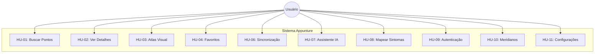
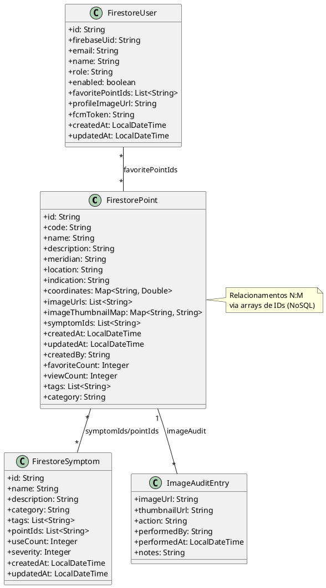
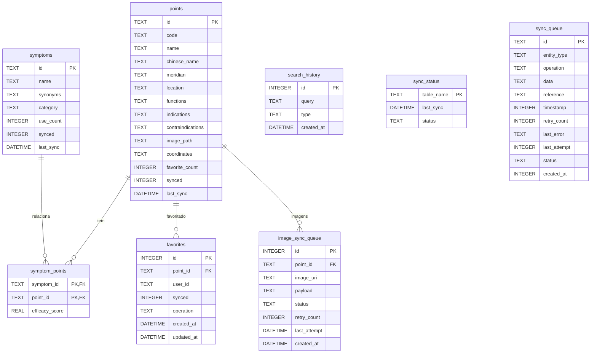
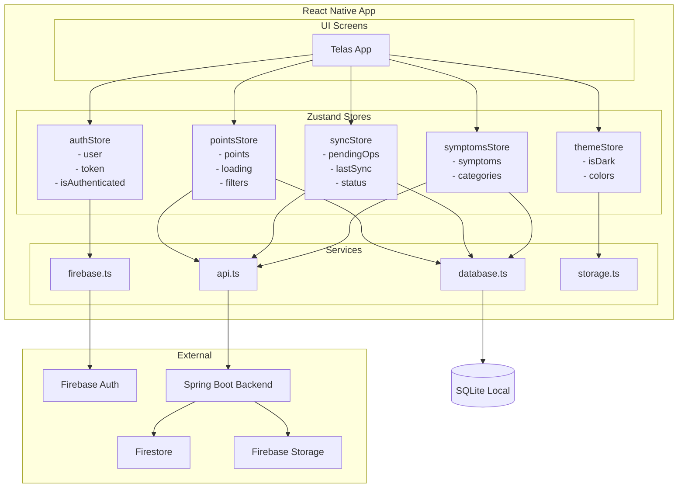

# Análise Completa dos Diagramas do TCC Appunture

**Data:** Dezembro de 2025  
**Objetivo:** Verificar todos os diagramas do TCC contra o código real implementado e propor correções

---

## 📊 Inventário de Diagramas

### Diagramas Encontrados no TCC (`fig/`)

| #   | Arquivo                       | Tipo            | Status               |
| --- | ----------------------------- | --------------- | -------------------- |
| 1   | `arquitetura.png`             | Arquitetura     | 🔍 Verificar         |
| 2   | `casos-de-uso.png`            | Casos de Uso    | ⚠️ **CORRIGIR**      |
| 3   | `casos-uso-parte1.png`        | Casos de Uso    | 🔍 Verificar         |
| 4   | `casos-uso-parte2.png`        | Casos de Uso    | 🔍 Verificar         |
| 5   | `classes.png`                 | Classes         | ⚠️ **CORRIGIR**      |
| 6   | `modelo-logico-sqlite.png`    | Modelo DB       | ⚠️ **CORRIGIR**      |
| 7   | `modelo-logico-firestore.png` | Modelo DB       | 🔍 Verificar         |
| 8   | `seq-busca.png`               | Sequência HU-01 | ✅ OK                |
| 9   | `seq-detalhes.png`            | Sequência HU-02 | ✅ OK                |
| 10  | `seq-atlas.png`               | Sequência HU-03 | ✅ OK                |
| 11  | `seq-favoritos.png`           | Sequência HU-04 | ✅ OK                |
| 12  | `seq-anotacao.png`            | Sequência HU-05 | ❌ **REMOVER/MOVER** |
| 13  | `seq-sync.png`                | Sequência HU-06 | ✅ OK                |
| 14  | `seq-ia.png`                  | Sequência HU-07 | ✅ OK                |
| 15  | `seq-mapper.png`              | Sequência HU-08 | ✅ OK                |
| 16  | `seq-loginemailsenha.png`     | Sequência HU-09 | ✅ OK                |
| 17  | `seq-cadastro.png`            | Sequência HU-09 | ✅ OK                |
| 18  | `seq-loginsocial.png`         | Sequência HU-09 | ✅ OK                |
| 19  | `seq-listarmeridianos.png`    | Sequência HU-10 | ✅ OK                |
| 20  | `seq-acessarmeridiano.png`    | Sequência HU-10 | ✅ OK                |
| 21  | `seq-infosmeridiano.png`      | Sequência HU-10 | ✅ OK                |
| 22  | `seq-apptheme.png`            | Sequência HU-11 | ✅ OK                |
| 23  | `seq-onoffnotifs.png`         | Sequência HU-11 | ✅ OK                |
| 24  | `seq-offline.png`             | Sequência HU-11 | ✅ OK                |
| 25  | `seq-logout.png`              | Sequência HU-11 | ✅ OK                |
| 26  | `seq-statussync.png`          | Sequência HU-11 | ✅ OK                |

---

## 🔴 Problemas Críticos Encontrados

### 1. Diagrama de Casos de Uso - HU-05 Anotações NÃO IMPLEMENTADA

**Localização:** `fig/casos-de-uso.png` e `apendices.tex` seção HU-05

**Problema:** O diagrama de casos de uso inclui "Gerenciar Anotações Clínicas" como funcionalidade, mas:

- **Frontend:** Possui interface `Note` em `types/api.ts` e `types/database.ts`
- **Frontend:** Possui tabela `notes` no SQLite (`database.ts` linha 267)
- **Frontend:** Possui endpoints `createNote`, `updateNote`, `deleteNote` em `api.ts` (linhas 590-614)
- **Frontend:** Possui handler `handleNoteOperation` em `syncStore.ts` (linha 352)
- **Backend:** **NÃO POSSUI** `NoteController.java` - endpoints `/notes` não existem!
- **UI:** **NÃO POSSUI** tela de anotações - não existe em `app/(tabs)/`

**Conclusão:** Funcionalidade está **parcialmente preparada** no frontend mas **não funcional**. Deve ser removida dos diagramas de casos de uso ou marcada como "trabalho futuro".

**Ação Requerida:**

- Remover caso de uso "Gerenciar Anotações Clínicas" do diagrama
- Remover ou mover `seq-anotacao.png` para seção de trabalhos futuros
- Atualizar `apendices.tex` seção HU-05

---

### 2. Diagrama de Classes - Inconsistências com Código Real

**Localização:** `fig/classes.png` e `apendices.tex` Apêndice B

**Entidades Reais no Backend (Firestore):**

```java
// FirestorePoint.java - Campos reais:
- id: String
- code: String
- name: String
- description: String
- meridian: String
- location: String
- indication: String
- coordinates: Map<String, Double>
- imageUrls: List<String>
- imageThumbnailMap: Map<String, String>
- imageAudit: List<ImageAuditEntry>
- symptomIds: List<String>
- createdAt: LocalDateTime
- updatedAt: LocalDateTime
- createdBy: String
- favoriteCount: Integer
- viewCount: Integer
- tags: List<String>
- category: String

// FirestoreUser.java - Campos reais:
- id: String
- firebaseUid: String
- email: String
- name: String
- role: String (USER/ADMIN)
- enabled: boolean
- createdAt: LocalDateTime
- updatedAt: LocalDateTime
- favoritePointIds: List<String>
- profileImageUrl: String
- phoneNumber: String
- emailVerified: boolean
- fcmToken: String
- notificationTopics: List<String>

// FirestoreSymptom.java - Campos reais:
- id: String
- name: String
- description: String
- category: String
- tags: List<String>
- pointIds: List<String>
- createdAt: LocalDateTime
- updatedAt: LocalDateTime
- createdBy: String
- useCount: Integer
- associatedPointsCount: Integer
- severity: Integer
- priority: Integer
```

**Verificar no Diagrama:**

- [ ] Classe `Note` deve ser removida ou marcada como "não implementada"
- [ ] Verificar se campos de auditoria de imagem estão representados
- [ ] Verificar se relacionamentos N:M estão corretos (Point <-> Symptom via IDs)
- [ ] Adicionar classe `ImageAuditEntry` se relevante

---

### 3. Modelo Lógico SQLite - Verificar Tabelas

**Localização:** `fig/modelo-logico-sqlite.png`

**Tabelas Reais no SQLite (database.ts):**

```sql
-- 1. points
CREATE TABLE points (
  id TEXT PRIMARY KEY,
  code TEXT,
  name TEXT NOT NULL,
  chinese_name TEXT,
  meridian TEXT NOT NULL,
  location TEXT NOT NULL,
  functions TEXT,
  indications TEXT,
  contraindications TEXT,
  image_path TEXT,
  coordinates TEXT,
  favorite_count INTEGER,
  synced INTEGER DEFAULT 1,
  last_sync DATETIME
);

-- 2. symptoms
CREATE TABLE symptoms (
  id TEXT PRIMARY KEY,
  name TEXT NOT NULL,
  synonyms TEXT,
  category TEXT,
  use_count INTEGER,
  synced INTEGER DEFAULT 1,
  last_sync DATETIME
);

-- 3. symptom_points (relacionamento N:M)
CREATE TABLE symptom_points (
  symptom_id TEXT NOT NULL,
  point_id TEXT NOT NULL,
  efficacy_score REAL DEFAULT 1.0,
  PRIMARY KEY(symptom_id, point_id)
);

-- 4. favorites
CREATE TABLE favorites (
  id INTEGER PRIMARY KEY AUTOINCREMENT,
  point_id TEXT NOT NULL,
  user_id TEXT NOT NULL,
  synced INTEGER DEFAULT 0,
  operation TEXT NOT NULL DEFAULT 'UPSERT',
  created_at DATETIME DEFAULT CURRENT_TIMESTAMP,
  updated_at DATETIME DEFAULT CURRENT_TIMESTAMP,
  UNIQUE(point_id, user_id)
);

-- 5. notes (EXISTE MAS NÃO É USADA NA UI!)
CREATE TABLE notes (
  id INTEGER PRIMARY KEY AUTOINCREMENT,
  point_id TEXT NOT NULL,
  user_id TEXT NOT NULL,
  content TEXT NOT NULL,
  synced INTEGER DEFAULT 0,
  created_at DATETIME DEFAULT CURRENT_TIMESTAMP,
  updated_at DATETIME DEFAULT CURRENT_TIMESTAMP
);

-- 6. search_history
CREATE TABLE search_history (
  id INTEGER PRIMARY KEY AUTOINCREMENT,
  query TEXT NOT NULL,
  type TEXT NOT NULL,
  created_at DATETIME DEFAULT CURRENT_TIMESTAMP
);

-- 7. sync_status
CREATE TABLE sync_status (
  table_name TEXT PRIMARY KEY,
  last_sync DATETIME NOT NULL,
  status TEXT NOT NULL DEFAULT 'success'
);

-- 8. sync_queue
CREATE TABLE sync_queue (
  id TEXT PRIMARY KEY,
  entity_type TEXT NOT NULL,
  operation TEXT NOT NULL,
  data TEXT NOT NULL,
  reference TEXT,
  timestamp INTEGER NOT NULL,
  retry_count INTEGER NOT NULL DEFAULT 0,
  last_error TEXT,
  last_attempt INTEGER,
  status TEXT NOT NULL DEFAULT 'pending',
  created_at INTEGER NOT NULL
);

-- 9. image_sync_queue
CREATE TABLE image_sync_queue (
  id INTEGER PRIMARY KEY AUTOINCREMENT,
  point_id TEXT NOT NULL,
  image_uri TEXT NOT NULL,
  payload TEXT,
  status TEXT NOT NULL DEFAULT 'pending',
  retry_count INTEGER NOT NULL DEFAULT 0,
  last_attempt DATETIME,
  created_at DATETIME DEFAULT CURRENT_TIMESTAMP
);
```

**Verificar no Diagrama:**

- [ ] Total de 9 tabelas devem estar representadas
- [ ] Tabela `notes` pode ser marcada como "preparada para implementação futura"
- [ ] Tabelas de sync (`sync_queue`, `sync_status`, `image_sync_queue`) devem estar presentes
- [ ] Relacionamentos FK devem estar corretos

---

### 4. Modelo Lógico Firestore - Verificar Collections

**Localização:** `fig/modelo-logico-firestore.png`

**Collections Reais:**

| Collection | Documento        | Subcollections |
| ---------- | ---------------- | -------------- |
| `points`   | FirestorePoint   | -              |
| `symptoms` | FirestoreSymptom | -              |
| `users`    | FirestoreUser    | -              |

**Relacionamentos por ID (NoSQL):**

- `Point.symptomIds[]` → referencia `Symptom.id`
- `Symptom.pointIds[]` → referencia `Point.id`
- `User.favoritePointIds[]` → referencia `Point.id`

---

## 🟡 Diagramas que Precisam de Revisão

### 5. Diagrama de Arquitetura

**Localização:** `fig/arquitetura.png`

**Verificar se contém:**

- [x] React Native + Expo (frontend)
- [x] Spring Boot (backend)
- [x] Firebase Auth
- [x] Firestore (database cloud)
- [x] SQLite (database local)
- [x] Firebase Storage (imagens)
- [ ] Zustand (5 stores) - provavelmente não está
- [ ] AsyncStorage/SecureStore - provavelmente não está

**Stores Zustand Reais:**

1. `authStore.ts` - Autenticação
2. `pointsStore.ts` - Pontos de acupuntura
3. `syncStore.ts` - Sincronização
4. `symptomsStore.ts` - Sintomas
5. `themeStore.ts` - Tema

---

## ✅ Diagramas de Sequência - Status

| HU    | Nome                | Status     | Observação                          |
| ----- | ------------------- | ---------- | ----------------------------------- |
| HU-01 | Busca de Pontos     | ✅ OK      | Implementado em `search.tsx`        |
| HU-02 | Detalhes do Ponto   | ✅ OK      | Implementado em `point-details.tsx` |
| HU-03 | Atlas Visual        | ✅ OK      | Implementado em `body-map.tsx`      |
| HU-04 | Favoritos           | ✅ OK      | Implementado em `favorites.tsx`     |
| HU-05 | Anotações           | ❌ REMOVER | **Não implementado**                |
| HU-06 | Sincronização       | ✅ OK      | Implementado em `syncStore.ts`      |
| HU-07 | Assistente IA       | ✅ OK      | Implementado em `chatbot.tsx`       |
| HU-08 | Mapeamento Sintomas | ✅ OK      | Implementado em `symptoms.tsx`      |
| HU-09 | Autenticação        | ✅ OK      | Login, Registro, Google OAuth       |
| HU-10 | Meridianos          | ✅ OK      | Implementado em `meridians.tsx`     |
| HU-11 | Configurações       | ✅ OK      | Implementado em `profile.tsx`       |

---

## 📝 Ações Corretivas Necessárias

### Ação 1: Atualizar Diagrama de Casos de Uso

Remover caso de uso "HU-05: Gerenciar Anotações Clínicas" ou marcá-lo como "não implementado".

**Mermaid para novo diagrama:**



### Ação 2: Remover/Mover Diagrama seq-anotacao.png

**Opção A:** Remover completamente do TCC
**Opção B:** Mover para seção "Trabalhos Futuros" com nota explicativa

### Ação 3: Atualizar Diagrama de Classes

**PlantUML Corrigido:**



### Ação 4: Atualizar Modelo SQLite

**Mermaid ERD:**



### Ação 5: Atualizar Modelo Firestore

**Mermaid para Modelo NoSQL:**

```mermaid
graph TB
    subgraph Firestore Collections
        P[📁 points]
        S[📁 symptoms]
        U[📁 users]
    end

    subgraph "Document: Point"
        PD[id, code, name<br/>meridian, location<br/>indication, coordinates<br/>imageUrls[], symptomIds[]<br/>favoriteCount, viewCount<br/>tags[], category<br/>createdAt, updatedAt]
    end

    subgraph "Document: Symptom"
        SD[id, name, description<br/>category, tags[]<br/>pointIds[]<br/>useCount, severity<br/>createdAt, updatedAt]
    end

    subgraph "Document: User"
        UD[id, firebaseUid, email<br/>name, role, enabled<br/>favoritePointIds[]<br/>profileImageUrl<br/>fcmToken<br/>createdAt, updatedAt]
    end

    P --> PD
    S --> SD
    U --> UD

    PD -.->|symptomIds| SD
    SD -.->|pointIds| PD
    UD -.->|favoritePointIds| PD
```

### Ação 6: Criar Diagrama de Arquitetura de Stores

**Diagrama Novo Sugerido (não existe no TCC):**



---

## 📋 Checklist de Correções

- [ ] Remover HU-05 (Anotações) do diagrama de casos de uso
- [ ] Remover ou mover `seq-anotacao.png`
- [ ] Atualizar `apendices.tex` seção HU-05
- [ ] Verificar diagrama de classes contra código real
- [ ] Verificar modelo SQLite (9 tabelas)
- [ ] Verificar modelo Firestore (3 collections)
- [ ] Considerar adicionar diagrama de Stores Zustand
- [ ] Atualizar diagrama de arquitetura para incluir Zustand

---

## 🎯 Resumo Executivo

| Categoria    | Total  | OK     | Correção | Remover |
| ------------ | ------ | ------ | -------- | ------- |
| Casos de Uso | 1      | 0      | 1        | 0       |
| Classes      | 1      | 0      | 1        | 0       |
| Modelo DB    | 2      | 1      | 1        | 0       |
| Sequência    | 19     | 18     | 0        | 1       |
| Arquitetura  | 1      | 0      | 1        | 0       |
| Protótipos   | 9      | 9      | 0        | 0       |
| Screenshots  | 9      | 9      | 0        | 0       |
| **TOTAL**    | **42** | **37** | **4**    | **1**   |

**Problema Principal:** HU-05 Anotações Clínicas está documentada com diagrama de sequência mas **NÃO está implementada** no sistema. O frontend tem a infraestrutura preparada (tipos, tabela SQLite, endpoints), mas o backend não tem o controller e não existe tela no app.

---

_Documento gerado em Dezembro de 2025_
