# 📊 Diagramas Mermaid Completos - TCC Appunture

**Data de Atualização:** Dezembro de 2025  
**Versão:** 2.0 - Atualizada com base no código real implementado

Este arquivo contém todos os diagramas em formato Mermaid para o TCC do projeto Appunture.

---

## Índice

1. [Diagrama de Casos de Uso](#1-diagrama-de-casos-de-uso)
2. [Diagrama de Classes - Backend](#2-diagrama-de-classes---backend)
3. [Diagrama de Classes - Frontend](#3-diagrama-de-classes---frontend)
4. [Modelo de Dados - SQLite Local](#4-modelo-de-dados---sqlite-local)
5. [Modelo de Dados - Firestore](#5-modelo-de-dados---firestore)
6. [Diagrama de Arquitetura](#6-diagrama-de-arquitetura)
7. [Diagrama de Componentes](#7-diagrama-de-componentes)
8. [Diagrama de Estados - Stores Zustand](#8-diagrama-de-estados---stores-zustand)
9. [Diagramas de Sequência](#9-diagramas-de-sequência)
   - 9.1 [HU-01: Busca de Pontos](#91-hu-01-busca-de-pontos)
   - 9.2 [HU-02: Detalhes do Ponto](#92-hu-02-detalhes-do-ponto)
   - 9.3 [HU-03: Atlas Visual](#93-hu-03-atlas-visual)
   - 9.4 [HU-04: Gerenciamento de Favoritos](#94-hu-04-gerenciamento-de-favoritos)
   - 9.5 [HU-05: Sincronização de Dados](#95-hu-05-sincronização-de-dados)
   - 9.6 [HU-06: Assistente IA](#96-hu-06-assistente-ia)
   - 9.7 [HU-07: Mapeamento de Sintomas](#97-hu-07-mapeamento-de-sintomas)
   - 9.8 [HU-08: Autenticação](#98-hu-08-autenticação)
   - 9.9 [HU-09: Navegação por Meridianos](#99-hu-09-navegação-por-meridianos)
   - 9.10 [HU-10: Configurações](#910-hu-10-configurações)
10. [Fluxo de Sincronização Offline-First](#10-fluxo-de-sincronização-offline-first)

---

## 1. Diagrama de Casos de Uso

**Arquivo:** `fig/casos-de-uso.png`

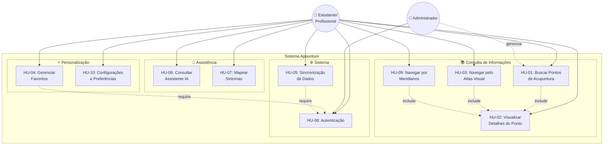

---

## 2. Diagrama de Classes - Backend

**Arquivo:** `fig/classes.png`

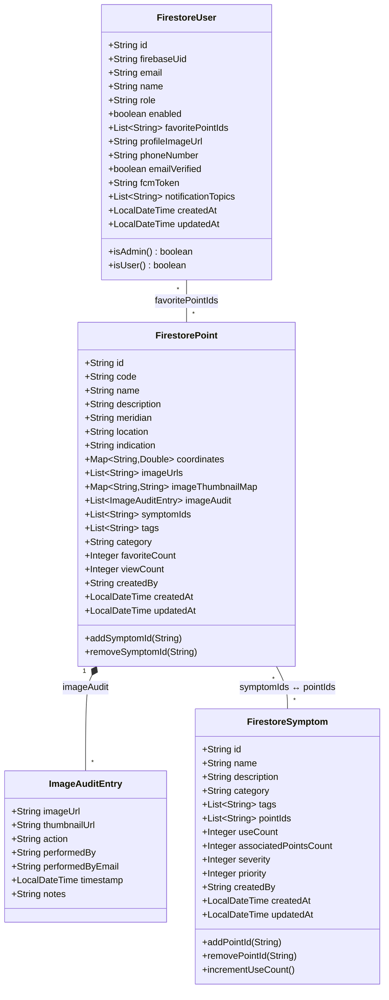

---

## 3. Diagrama de Classes - Frontend

**Arquivo:** `fig/classes-frontend.png`

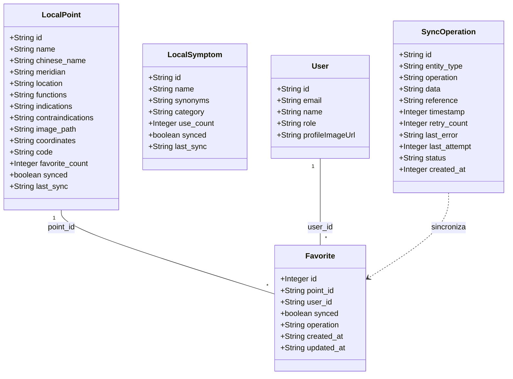

---

## 4. Modelo de Dados - SQLite Local

**Arquivo:** `fig/modelo-logico-sqlite.png`

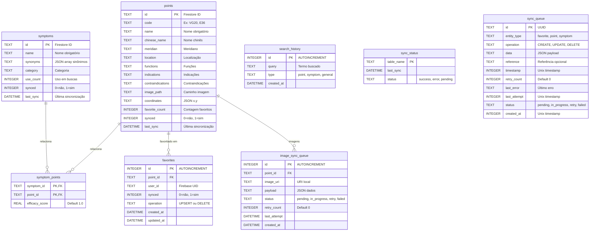

---

## 5. Modelo de Dados - Firestore

**Arquivo:** `fig/modelo-logico-firestore.png`

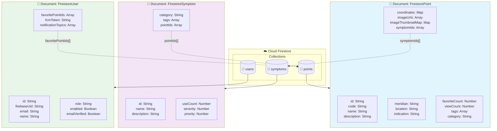

---

## 6. Diagrama de Arquitetura

**Arquivo:** `fig/arquitetura.png`

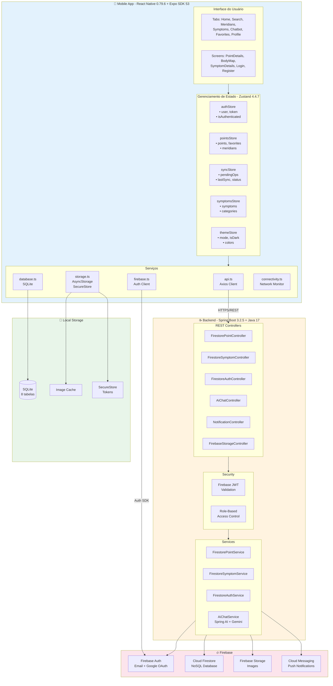

---

## 7. Diagrama de Componentes

**Arquivo:** `fig/componentes.png`

```mermaid
flowchart TB
    subgraph Frontend["Frontend Mobile"]
        subgraph AppLayer["App Layer"]
            Router["Expo Router<br/>Navigation"]
            Tabs["Tab Navigator<br/>7 tabs"]
        end

        subgraph ScreensLayer["Screens"]
            Home["HomeScreen"]
            Search["SearchScreen"]
            Meridians["MeridiansScreen"]
            Symptoms["SymptomsScreen"]
            Chatbot["ChatbotScreen"]
            Favorites["FavoritesScreen"]
            Profile["ProfileScreen"]
            PointDetails["PointDetailsScreen"]
            BodyMap["BodyMapScreen"]
        end

        subgraph ComponentsLayer["Components"]
            PointCard["PointCard"]
            SearchBar["SearchBar"]
            BodySVG["BodyMapSVG"]
            ImageGallery["ImageGallery"]
            ChatMessage["ChatMessage"]
            MeridianCard["MeridianCard"]
        end

        subgraph StoresLayer["Stores - Zustand"]
            Auth["useAuthStore"]
            Points["usePointsStore"]
            Sync["useSyncStore"]
            SymptomsS["useSymptomsStore"]
            Theme["useThemeStore"]
        end

        subgraph ServicesLayer["Services"]
            ApiSvc["apiService"]
            DbSvc["databaseService"]
            FirebaseSvc["firebaseAuth"]
            StorageSvc["storageService"]
            ConnSvc["connectivityService"]
        end
    end

    Router --> Tabs
    Tabs --> ScreensLayer
    ScreensLayer --> ComponentsLayer
    ScreensLayer --> StoresLayer
    StoresLayer --> ServicesLayer

    style AppLayer fill:#bbdefb
    style ScreensLayer fill:#c8e6c9
    style ComponentsLayer fill:#fff9c4
    style StoresLayer fill:#f8bbd9
    style ServicesLayer fill:#d1c4e9
```

---

## 8. Diagrama de Estados - Stores Zustand

**Arquivo:** `fig/estados-stores.png`

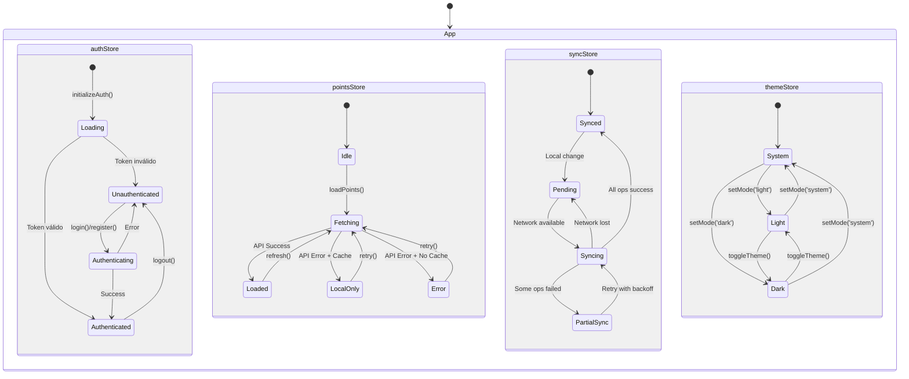

---

## 9. Diagramas de Sequência

### 9.1 HU-01: Busca de Pontos

**Arquivo:** `fig/seq-busca.png`

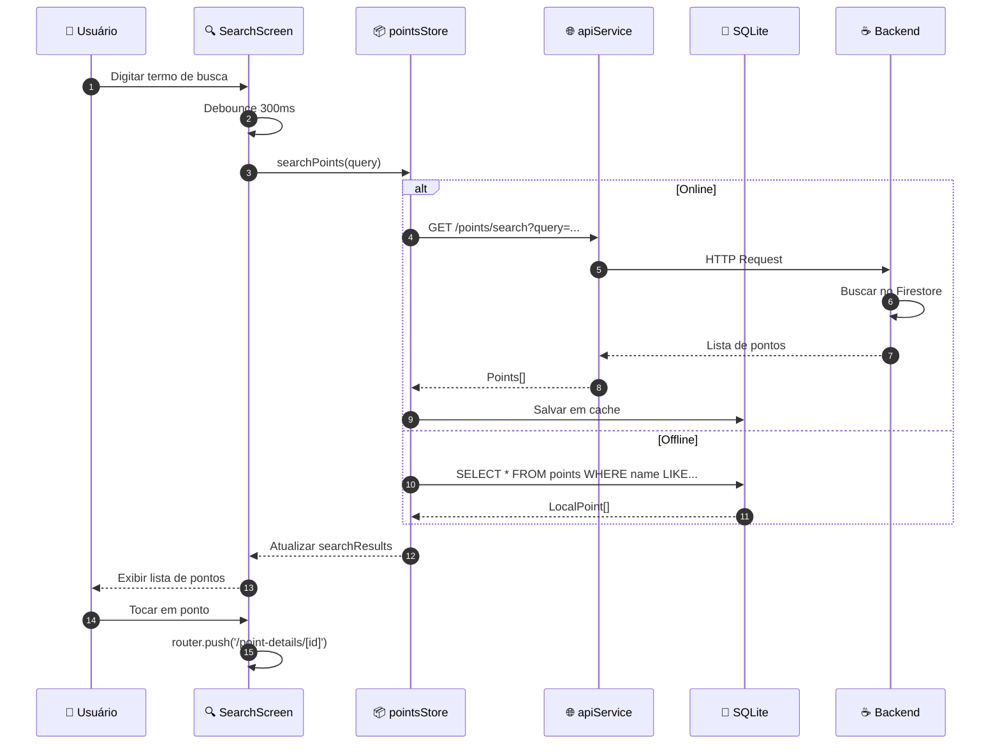

---

### 9.2 HU-02: Detalhes do Ponto

**Arquivo:** `fig/seq-detalhes.png`

```mermaid
sequenceDiagram
    autonumber
    participant User as 👤 Usuário
    participant Details as 📄 PointDetailsScreen
    participant Store as 📦 pointsStore
    participant API as 🌐 apiService
    participant DB as 💾 SQLite
    participant Backend as ☕ Backend
    participant Storage as 🖼️ Firebase Storage

    User->>Details: Abrir tela de detalhes
    Details->>Store: loadPoint(pointId)

    alt Online
        Store->>API: GET /points/{id}
        API->>Backend: HTTP Request
        Backend->>Backend: Firestore.get(pointId)
        Backend-->>API: PointWithSymptoms
        API-->>Store: Dados completos
        Store->>DB: Atualizar cache local
    else Offline
        Store->>DB: getPointById(id)
        DB-->>Store: LocalPoint
    end

    Store-->>Details: selectedPoint
    Details->>Details: Renderizar informações

    alt Possui imagens
        Details->>Storage: Carregar imageUrls[]
        Storage-->>Details: Imagens do ponto
        Details->>Details: Exibir galeria
    end

    Details-->>User: Tela completa renderizada
```

---

### 9.3 HU-03: Atlas Visual

**Arquivo:** `fig/seq-atlas.png`

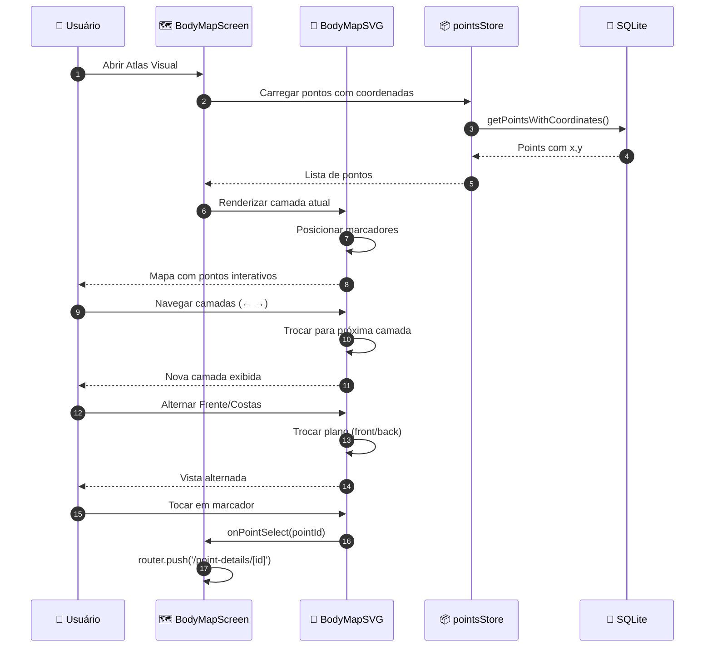

---

### 9.4 HU-04: Gerenciamento de Favoritos

**Arquivo:** `fig/seq-favoritos.png`

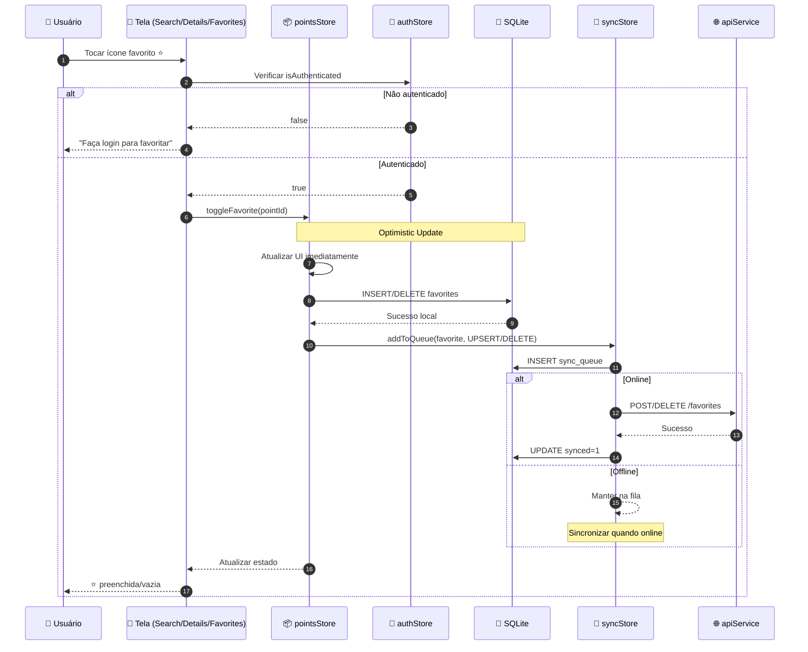

---

### 9.5 HU-05: Sincronização de Dados

**Arquivo:** `fig/seq-sync.png`

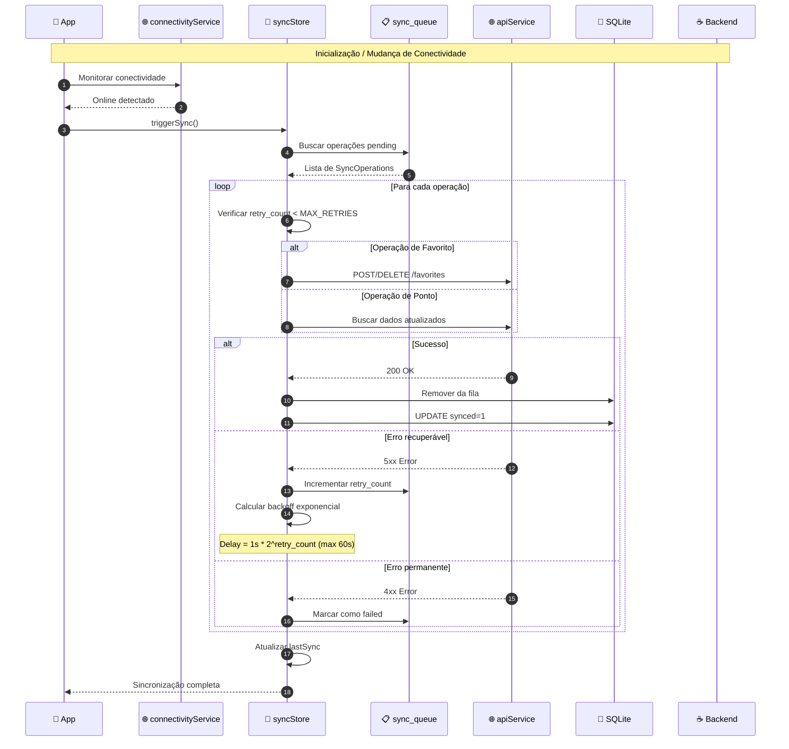

---

### 9.6 HU-06: Assistente IA

**Arquivo:** `fig/seq-ia.png`

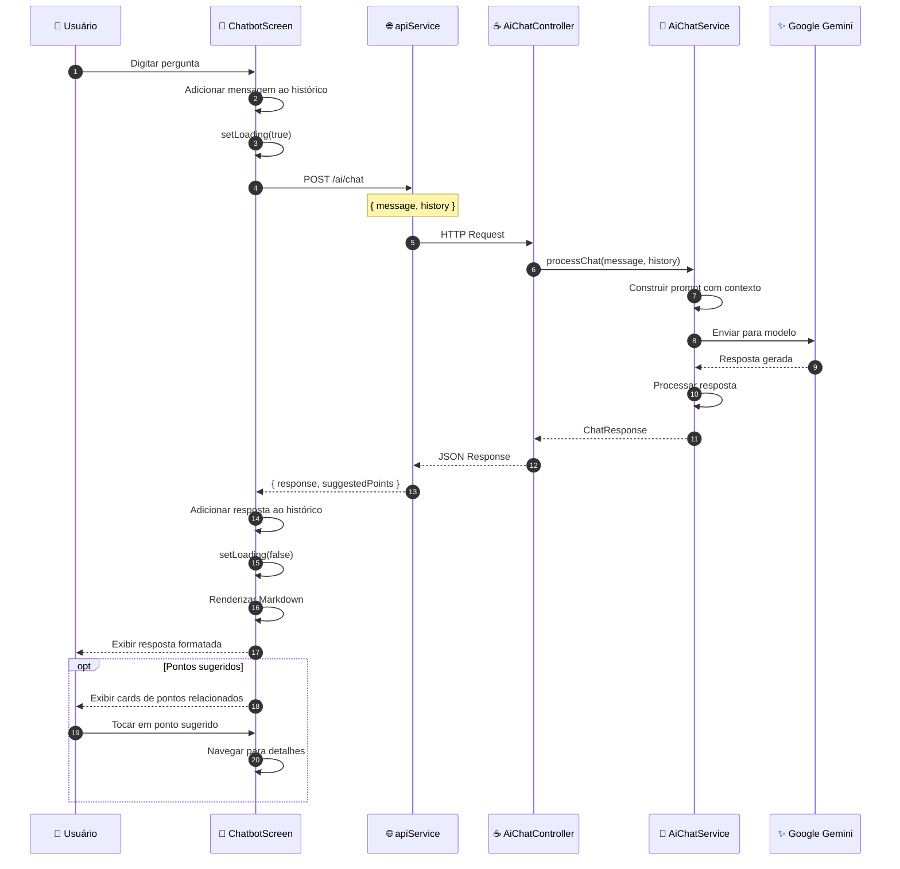

---

### 9.7 HU-07: Mapeamento de Sintomas

**Arquivo:** `fig/seq-mapper.png`

```mermaid
sequenceDiagram
    autonumber
    participant User as 👤 Usuário
    participant Symptoms as 🩺 SymptomsScreen
    participant Store as 📦 symptomsStore
    participant API as 🌐 apiService
    participant Backend as ☕ Backend
    participant Details as 📄 SymptomDetailsScreen

    User->>Symptoms: Abrir tela de sintomas
    Symptoms->>Store: fetchSymptoms()
    Store->>API: GET /symptoms
    API->>Backend: HTTP Request
    Backend-->>API: Lista de sintomas
    API-->>Store: Symptom[]
    Store-->>Symptoms: Atualizar lista

    User->>Symptoms: Filtrar por categoria
    Symptoms->>Store: fetchSymptomsByCategory(category)
    Store->>API: GET /symptoms?category=...
    API-->>Store: Sintomas filtrados
    Store-->>Symptoms: Lista atualizada

    User->>Symptoms: Buscar sintoma
    Symptoms->>Store: searchSymptoms(query)
    Store->>API: GET /symptoms/search?query=...
    API-->>Store: Resultados
    Store-->>Symptoms: Exibir resultados

    User->>Symptoms: Selecionar sintoma
    Symptoms->>Details: Navegar para detalhes
    Details->>Store: fetchSymptomById(id)
    Store->>API: GET /symptoms/{id}
    API-->>Store: SymptomWithPoints
    Store-->>Details: Dados + pontos relacionados
    Details-->>User: Exibir pontos recomendados

    Note over Details,User: ⚠️ Aviso: Uso educacional apenas
```

---

### 9.8 HU-08: Autenticação

**Arquivo:** `fig/seq-auth.png`

#### Login com Email/Senha

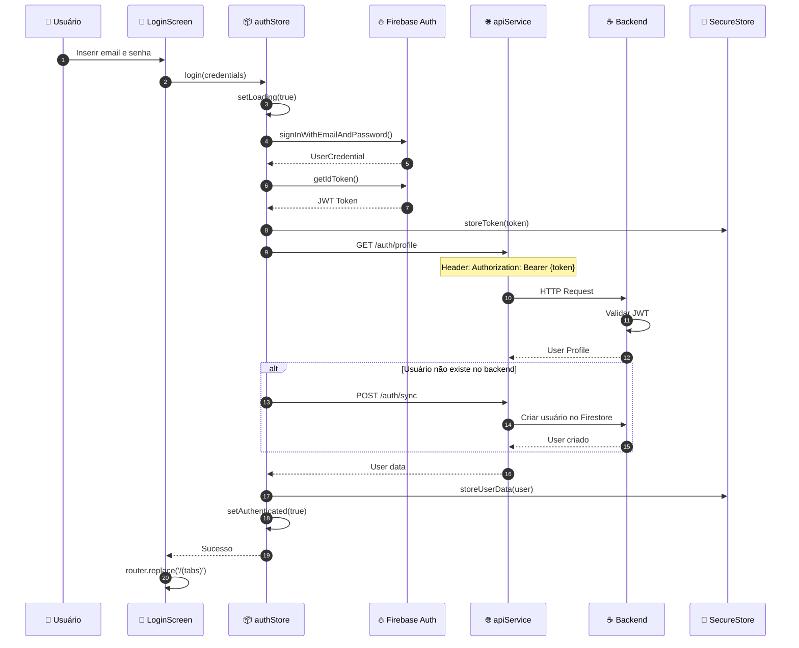

#### Login Social (Google)

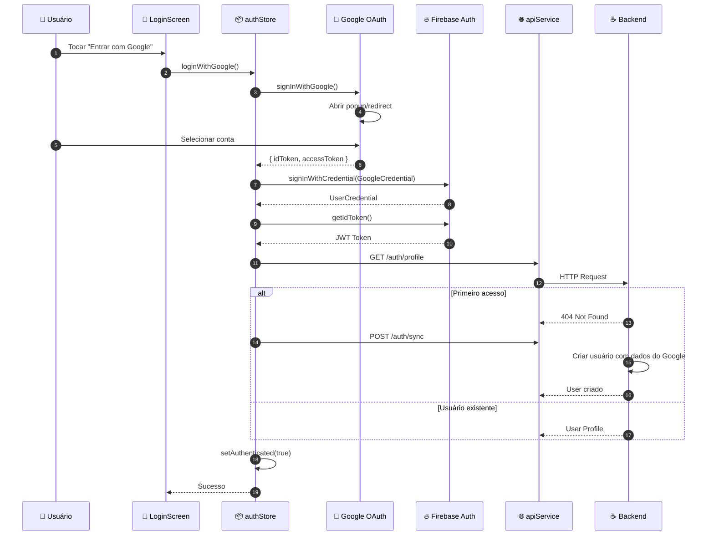

#### Cadastro

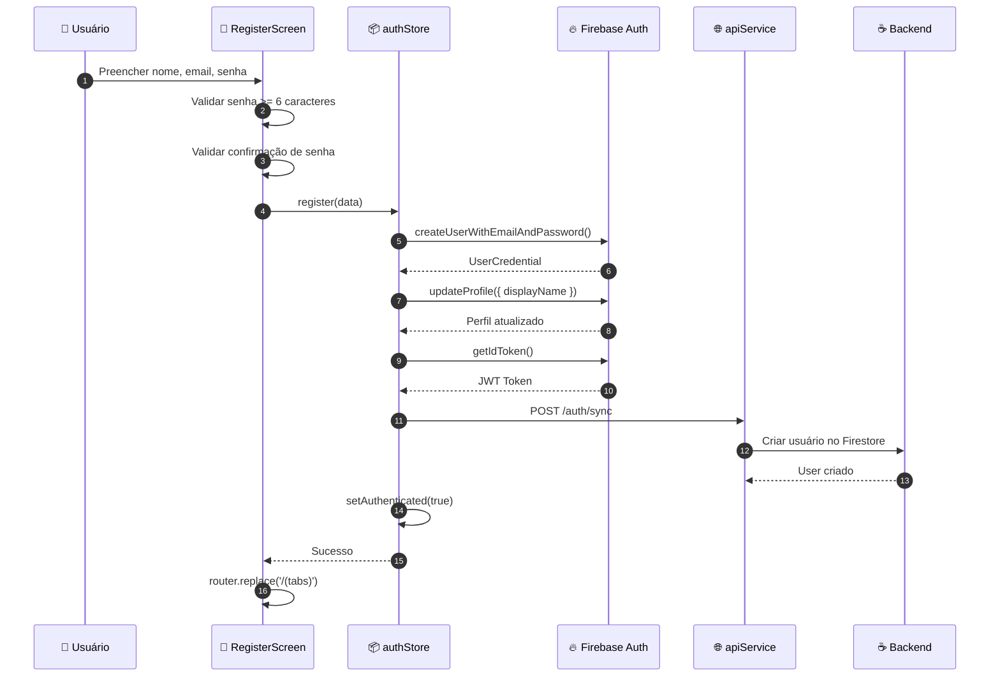

---

### 9.9 HU-09: Navegação por Meridianos

**Arquivo:** `fig/seq-meridianos.png`

```mermaid
sequenceDiagram
    autonumber
    participant User as 👤 Usuário
    participant Meridians as 🔮 MeridiansScreen
    participant Store as 📦 pointsStore
    participant API as 🌐 apiService
    participant Backend as ☕ Backend
    participant Details as 📄 MeridianDetailsScreen

    User->>Meridians: Abrir tela de meridianos
    Meridians->>Store: loadMeridians()
    Store->>API: GET /points/meridians
    API->>Backend: HTTP Request
    Backend->>Backend: Aggregate por meridiano
    Backend-->>API: Lista com contagem
    API-->>Store: Meridians[]
    Store-->>Meridians: Dados dos meridianos

    Meridians->>Meridians: Renderizar cards
    Note over Meridians: Exibir: nome, elemento Wu Xing,<br/>horário, órgão, cor, quantidade

    Meridians-->>User: Lista de meridianos

    User->>Meridians: Selecionar meridiano
    Meridians->>Details: Navegar para detalhes
    Details->>Store: loadPointsByMeridian(meridian)
    Store->>API: GET /points?meridian=...
    API-->>Store: Points do meridiano
    Store-->>Details: Lista de pontos
    Details-->>User: Exibir pontos do meridiano
```

---

### 9.10 HU-10: Configurações

**Arquivo:** `fig/seq-config.png`

#### Alternar Tema

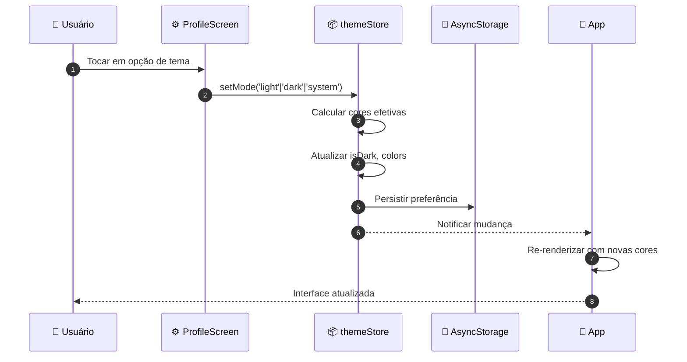

#### Logout

```mermaid
sequenceDiagram
    autonumber
    participant User as 👤 Usuário
    participant Profile as ⚙️ ProfileScreen
    participant Store as 📦 authStore
    participant Firebase as 🔥 Firebase Auth
    participant Storage as 💾 SecureStore
    participant DB as 💾 SQLite

    User->>Profile: Tocar em "Sair"
    Profile->>Profile: Exibir confirmação
    User->>Profile: Confirmar logout

    Profile->>Store: logout()
    Store->>Firebase: signOut()
    Firebase-->>Store: Sucesso

    Store->>Storage: removeToken()
    Store->>Storage: removeUserData()
    Store->>DB: Limpar dados do usuário

    Store->>Store: Reset state
    Store-->>Profile: Logout completo
    Profile->>Profile: router.replace('/login')
```

---

## 10. Fluxo de Sincronização Offline-First

**Arquivo:** `fig/fluxo-sync.png`

```mermaid
flowchart TB
    subgraph UserAction["👤 Ação do Usuário"]
        A1[Adicionar Favorito]
        A2[Remover Favorito]
    end

    subgraph LocalFirst["💾 Local First"]
        L1[Atualizar UI<br/>Optimistic Update]
        L2[Salvar SQLite<br/>synced=0]
        L3[Adicionar à<br/>sync_queue]
    end

    subgraph NetworkCheck["🌐 Verificação de Rede"]
        N1{Online?}
    end

    subgraph SyncProcess["🔄 Processo de Sincronização"]
        S1[Buscar operações<br/>pending]
        S2[Processar operação]
        S3{Sucesso?}
        S4[Remover da fila<br/>synced=1]
        S5[Incrementar retry]
        S6{retry < MAX?}
        S7[Calcular backoff<br/>exponencial]
        S8[Marcar como<br/>failed]
    end

    subgraph Backend["☕ Backend API"]
        B1[POST/DELETE<br/>/favorites]
        B2[Atualizar<br/>Firestore]
    end

    A1 --> L1
    A2 --> L1
    L1 --> L2
    L2 --> L3
    L3 --> N1

    N1 -->|Sim| S1
    N1 -->|Não| W1[Aguardar<br/>conectividade]
    W1 -.->|Quando online| S1

    S1 --> S2
    S2 --> B1
    B1 --> B2
    B2 --> S3

    S3 -->|Sim| S4
    S3 -->|Não| S5
    S5 --> S6
    S6 -->|Sim| S7
    S7 -.->|Após delay| S2
    S6 -->|Não| S8

    style UserAction fill:#e3f2fd
    style LocalFirst fill:#e8f5e9
    style SyncProcess fill:#fff3e0
    style Backend fill:#fce4ec
```

---

## Instruções para Gerar Imagens

### Mermaid CLI

```bash
# Instalar
npm install -g @mermaid-js/mermaid-cli

# Gerar PNG
mmdc -i diagrama.mmd -o diagrama.png -t neutral -b white -w 1200

# Gerar SVG (melhor qualidade)
mmdc -i diagrama.mmd -o diagrama.svg -t neutral -b white
```

### Ferramentas Online

- **Mermaid Live Editor:** https://mermaid.live/
- **Mermaid Chart:** https://www.mermaidchart.com/

### VS Code Extensions

- **Mermaid Preview:** `bierner.markdown-mermaid`
- **Mermaid Editor:** `tomoyukim.vscode-mermaid-editor`

---

## Checklist de Substituição de Arquivos

| Arquivo Original                  | Diagrama Mermaid | Status        |
| --------------------------------- | ---------------- | ------------- |
| `fig/casos-de-uso.png`            | Seção 1          | ⬜ Substituir |
| `fig/classes.png`                 | Seção 2          | ⬜ Substituir |
| `fig/modelo-logico-sqlite.png`    | Seção 4          | ⬜ Substituir |
| `fig/modelo-logico-firestore.png` | Seção 5          | ⬜ Substituir |
| `fig/arquitetura.png`             | Seção 6          | ⬜ Substituir |
| `fig/seq-busca.png`               | Seção 9.1        | ⬜ Substituir |
| `fig/seq-detalhes.png`            | Seção 9.2        | ⬜ Substituir |
| `fig/seq-atlas.png`               | Seção 9.3        | ⬜ Substituir |
| `fig/seq-favoritos.png`           | Seção 9.4        | ⬜ Substituir |
| `fig/seq-sync.png`                | Seção 9.5        | ⬜ Substituir |
| `fig/seq-ia.png`                  | Seção 9.6        | ⬜ Substituir |
| `fig/seq-mapper.png`              | Seção 9.7        | ⬜ Substituir |
| `fig/seq-loginemailsenha.png`     | Seção 9.8        | ⬜ Substituir |
| `fig/seq-loginsocial.png`         | Seção 9.8        | ⬜ Substituir |
| `fig/seq-cadastro.png`            | Seção 9.8        | ⬜ Substituir |
| `fig/seq-listarmeridianos.png`    | Seção 9.9        | ⬜ Substituir |
| `fig/seq-acessarmeridiano.png`    | Seção 9.9        | ⬜ Substituir |
| `fig/seq-apptheme.png`            | Seção 9.10       | ⬜ Substituir |
| `fig/seq-logout.png`              | Seção 9.10       | ⬜ Substituir |
| `fig/seq-anotacao.png`            | ❌ REMOVER       | ⬜ Deletar    |

---

_Diagramas atualizados em Dezembro de 2025 - Versão 2.0_
