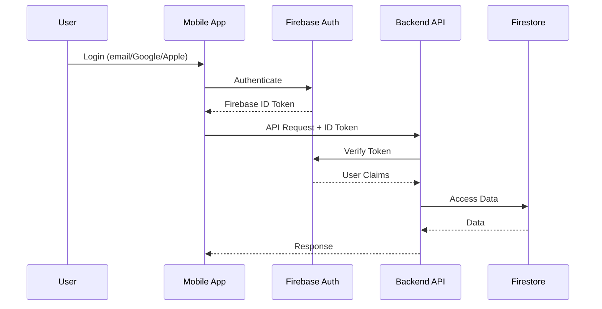

# ADR-003: Firebase Authentication

## Status

Accepted

## Context

O projeto Appunture necessita de um sistema de autenticação robusto que suporte:

1. **Múltiplos métodos de login** - Email/senha, Google, Apple
2. **Segurança enterprise-grade** - MFA, rate limiting, proteção contra ataques
3. **Integração mobile** - SDKs nativos para iOS e Android
4. **Zero manutenção** - Serviço gerenciado
5. **Custo zero** - Gratuito para o escopo do TCC

### Situação Anterior

- JWT customizado no backend Node.js
- Gerenciamento manual de tokens
- Password hashing com bcrypt
- Reset de senha implementado manualmente
- Sem social login

## Decision

Utilizaremos **Firebase Authentication** como sistema de autenticação unificado para mobile e backend.

### Arquitetura de Autenticação



### Fluxo de Autenticação

1. **Login no Mobile**: Usuário autentica via Firebase SDK
2. **Token ID**: Firebase retorna um JWT assinado
3. **Sync com Backend**: App chama `/auth/sync` para criar perfil no Firestore
4. **API Calls**: Todas as chamadas incluem token no header `Authorization: Bearer <token>`
5. **Verificação**: Backend valida token via Firebase Admin SDK

## Consequences

### Positivas

- ✅ **Segurança enterprise-grade**
  - Proteção contra brute force
  - Rate limiting automático
  - MFA disponível
  - Tokens auto-expiram

- ✅ **Social Login out-of-the-box**
  - Google Sign-In
  - Apple Sign-In (obrigatório para iOS)
  - Pronto para Facebook, Twitter, etc.

- ✅ **Zero manutenção**
  - Sem gerenciamento de senhas
  - Sem implementação de reset de senha
  - Security patches automáticos

- ✅ **SDKs nativos**
  - Integração nativa com iOS/Android
  - Persistência de sessão automática
  - Token refresh transparente

- ✅ **Custo zero**
  - Autenticação ilimitada no free tier
  - Verificação de email gratuita
  - Sem limites de usuários

- ✅ **Custom Claims**
  - Roles (USER, ADMIN) via custom claims
  - Claims verificadas no backend
  - Sem consulta extra ao banco

### Negativas

- ❌ **Vendor lock-in** com Firebase/Google
  - Mitigação: Camada de abstração no código

- ❌ **Dependência de serviço externo**
  - Mitigação: Fallback para modo offline

- ❌ **Customização limitada** de UI de login
  - Mitigação: UI própria usando SDK programático

- ❌ **Latência adicional** na verificação de token
  - Mitigação: Cache de tokens verificados (curto TTL)

## Implementation Details

### Mobile (React Native)

```typescript
// Login com email/senha
import { signInWithEmailAndPassword } from 'firebase/auth';
import { firebaseAuth } from '../services/firebase';

const credential = await signInWithEmailAndPassword(
  firebaseAuth,
  email,
  password
);
const idToken = await credential.user.getIdToken();
```

### Backend (Spring Boot)

```java
@Configuration
@EnableWebSecurity
public class SecurityConfig {

    @Bean
    public SecurityFilterChain filterChain(HttpSecurity http) throws Exception {
        return http
            .authorizeHttpRequests(auth -> auth
                .requestMatchers("/health/**").permitAll()
                .requestMatchers("/admin/**").hasRole("ADMIN")
                .anyRequest().authenticated()
            )
            .addFilterBefore(
                firebaseAuthFilter, 
                UsernamePasswordAuthenticationFilter.class
            )
            .build();
    }
}
```

### Custom Claims (Roles)

```java
// Definir role de admin
FirebaseAuth.getInstance()
    .setCustomUserClaims(uid, Map.of("role", "ADMIN"));

// Verificar no filter
FirebaseToken token = FirebaseAuth.getInstance()
    .verifyIdToken(idToken);
String role = (String) token.getClaims().get("role");
```

## Alternatives Considered

### Auth0

**Prós:**
- Muito customizável
- Bom para B2B
- SSO enterprise

**Contras:**
- Custo após 7000 MAU
- Mais complexo que necessário
- Menos integrado com stack Firebase

**Rejeitado por:** Custo e complexidade desnecessária

### AWS Cognito

**Prós:**
- Bem integrado com AWS
- Custo competitivo
- Amplify SDK

**Contras:**
- Menos integrado com Firebase/GCP
- SDK menos polido
- Configuração mais complexa

**Rejeitado por:** Stack não é AWS, preferência por Firebase

### Supabase Auth

**Prós:**
- Open source
- PostgreSQL integrado
- Row Level Security

**Contras:**
- Menos maduro
- Social login mais limitado
- Menor documentação

**Rejeitado por:** Menor maturidade e integração

### JWT Customizado (manter)

**Prós:**
- Controle total
- Sem dependências

**Contras:**
- Manutenção de segurança
- Implementar refresh tokens
- Social login manual
- Reset de senha manual

**Rejeitado por:** Esforço de desenvolvimento e riscos de segurança

## Referências

- [Firebase Auth Documentation](https://firebase.google.com/docs/auth)
- [Firebase Admin SDK](https://firebase.google.com/docs/admin/setup)
- [Custom Claims](https://firebase.google.com/docs/auth/admin/custom-claims)
- [Verify ID Tokens](https://firebase.google.com/docs/auth/admin/verify-id-tokens)
