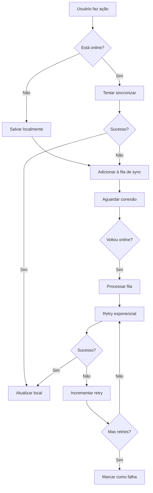

# Appunture Mobile

Aplicativo móvel React Native + Expo para consulta de pontos de acupuntura.

## 🚀 Funcionalidades

- **Busca de Pontos**: Pesquise pontos por nome, meridiano ou sintomas
- **Mapa Corporal**: Visualize pontos organizados por regiões do corpo
- **Assistente IA**: Chat inteligente para descobrir pontos baseado em sintomas
- **Favoritos**: Salve pontos importantes para acesso rápido
- **Sincronização**: Dados sincronizados com o backend quando online
- **Modo Offline**: Funciona sem conexão usando banco local

## 🛠 Tecnologias

- React Native (0.79.5)
- Expo (53.x)
- TypeScript
- Zustand (gerenciamento de estado)
- SQLite (banco local)
- React Query (cache e sincronização)
- Expo Router (navegação)

## 📱 Estrutura do App

```
app/
├── (tabs)/              # Telas principais em tabs
│   ├── index.tsx        # Tela inicial
│   ├── search.tsx       # Busca de pontos
│   ├── chatbot.tsx      # Assistente IA
│   ├── favorites.tsx    # Pontos favoritos
│   └── profile.tsx      # Perfil do usuário
├── body-map.tsx         # Mapa corporal
├── point-details.tsx    # Detalhes do ponto
├── login.tsx           # Login
├── register.tsx        # Cadastro
└── welcome.tsx         # Tela de boas-vindas

components/
├── SearchBar.tsx       # Barra de pesquisa
├── PointCard.tsx       # Card de ponto
├── ChatBubble.tsx      # Bolha de chat
└── BodyMap.tsx         # Componente do mapa corporal

services/
├── api.ts              # Comunicação com backend
├── database.ts         # Banco SQLite local
├── nlp.ts              # Processamento de linguagem natural
└── storage.ts          # Armazenamento local

stores/
├── authStore.ts        # Estado de autenticação
├── pointsStore.ts      # Estado dos pontos
└── syncStore.ts        # Estado de sincronização

types/
├── api.ts              # Tipos da API
├── database.ts         # Tipos do banco local
├── user.ts             # Tipos do usuário
└── navigation.ts       # Tipos de navegação
```

## 🔧 Configuração

1. **Instalar dependências**:

   ```bash
   cd frontend-mobile/appunture
   npm install
   ```

2. **Configurar backend/Firebase**:

   - Atualize os valores de `expo.extra` em `app.json` com as chaves do Firebase (`firebaseApiKey`, `firebaseProjectId`, etc.)
   - Opcional: defina variáveis de ambiente `EXPO_PUBLIC_*` equivalentes se preferir não commitar as chaves sensíveis
   - Ajuste `apiBaseUrl` para apontar para a API (o valor final usa automaticamente o sufixo `/api`)
   - Certifique-se de que o backend esteja rodando e aceitando tokens do Firebase

3. **Executar app**:
   ```bash
   npm start
   ```

## 📊 Stores (Zustand)

### AuthStore

- Gerencia autenticação do usuário
- Login/logout/registro
- Persistência do token

### PointsStore

- Lista de pontos de acupuntura
- Favoritos do usuário
- Cache local

### SyncStore

- Status de conectividade
- Sincronização entre local/remote
- Conflitos de dados

## 🗄 Banco de Dados

O app usa SQLite para armazenamento local com as seguintes tabelas:

- `points` - Pontos de acupuntura
- `symptoms` - Sintomas
- `favorites` - Pontos favoritos do usuário
- `sync_status` - Controle de sincronização

## 🤖 Assistente IA

O chatbot usa processamento local de linguagem natural para:

- Interpretar sintomas descritos pelo usuário
- Buscar pontos relacionados
- Sugerir tratamentos baseados em MTC
- Fornecer informações educativas

## 🎨 UI/UX

- Design Material Design/iOS nativo
- Tema claro/escuro
- Acessibilidade (VoiceOver/TalkBack)
- Responsivo para tablets
- Animações fluidas

## 🔄 Sincronização Offline

O app utiliza uma estratégia offline-first completa com sincronização inteligente:

### Funcionalidades

1. **Dados armazenados localmente primeiro**
2. **Sincronização automática quando online**
3. **Resolução de conflitos inteligente**
4. **Indicadores visuais de status**
5. **Retry automático com backoff exponencial**

### Fluxo de Sincronização



### Entidades Sincronizadas

- ✅ **Favoritos** (add/remove)
- ✅ **Pontos** (create/update/delete)
- ✅ **Sintomas** (create/update/delete)
- ✅ **Notas Pessoais** (create/update/delete)
- ✅ **Histórico de Buscas** (log)
- ✅ **Imagens** (upload)

### Retry Exponencial Backoff

O sistema implementa retry automático com backoff exponencial:

```typescript
Tentativa 1: imediato
Tentativa 2: 1 segundo
Tentativa 3: 2 segundos
Tentativa 4: 4 segundos
Tentativa 5: 8 segundos
Tentativa 6: 16 segundos
...
Máximo: 60 segundos
```

Após 5 tentativas falhadas, a operação é marcada como "falha" e pode ser tentada manualmente.

### Resolução de Conflitos

Utiliza estratégia **Last-Write-Wins** baseada em timestamps:

```typescript
if (localTimestamp > remoteTimestamp) {
  // Local é mais recente → enviar para servidor
  await api.updatePoint(localData);
} else {
  // Servidor é mais recente → atualizar local
  await database.updatePoint(remoteData);
}
```

### Indicadores Visuais

#### SyncBanner
Banner exibido no topo da tela mostrando:
- 🔴 **Offline**: "Modo Offline - Alterações serão sincronizadas quando conectar"
- 🔵 **Sincronizando**: "Sincronizando X itens..."
- ⚠️ **Falhas**: "X operações falharam" (clicável para ver detalhes)
- ⏳ **Pendentes**: "X pendentes" (sutil, quando há operações na fila)
- ✅ **Sucesso**: Toast temporário "X operações sincronizadas"

#### Badge no Perfil
Mostra número de operações pendentes no ícone do perfil:
- Aparece quando há operações na fila
- Exibe contador (ex: "5" ou "99+" se > 99)
- Vermelho para chamar atenção

#### Tela de Status (/sync-status)
Tela detalhada acessível clicando no banner de falhas ou no perfil:

**Seção 1: Status Geral**
- Indicador Online/Offline
- Última sincronização bem-sucedida
- Botão "Sincronizar Agora"

**Seção 2: Operações Pendentes**
- Contador de operações na fila
- Contador de imagens pendentes
- Estado vazio quando tudo sincronizado

**Seção 3: Operações Falhadas**
- Lista de operações que falharam
- Detalhes do erro para cada uma
- Botões:
  - ✅ "Tentar Novamente" (individual)
  - 🗑️ "Remover" (individual)
  - ♻️ "Tentar Todas" (bulk)
  - 🗑️ "Limpar Todas" (bulk)

### Comportamento Automático

1. **App inicia**: 
   - Verifica conectividade
   - Auto-sync se online e tem operações pendentes

2. **Reconexão**:
   - Detecta automaticamente via NetInfo
   - Inicia sync queue imediatamente

3. **Background Sync**:
   - Processa operações pendentes
   - Respei

ta backoff para operações falhadas
   - Continua mesmo se uma operação falhar

### Troubleshooting

#### Operações não sincronizam
1. Verificar conectividade (banner mostrará status)
2. Abrir `/sync-status` para ver detalhes
3. Verificar erros nas operações falhadas
4. Tentar "Sincronizar Agora" manualmente

#### Conflitos de dados
- Sistema usa last-write-wins automaticamente
- Prioriza dados mais recentes
- Não há perda de dados (versão antiga é substituída)

#### Fila de sync crescendo
- Verificar se há erros recorrentes
- Limpar operações obsoletas manualmente
- Tentar novamente operações falhadas
- Em último caso, "Limpar Todas" e refazer ações

### Desenvolvimento

Para testar sincronização offline:

```bash
# Rodar testes E2E de sync
npm run test -- syncStore.e2e.test.ts

# Testar manualmente:
# 1. Ativar modo avião
# 2. Fazer ações (favoritar, criar nota, etc)
# 3. Verificar que ficam pendentes
# 4. Desativar modo avião
# 5. Verificar que sincronizam automaticamente
```

### Arquitetura

```
┌─────────────────┐
│   UI Layer      │
│  SyncBanner     │ ← Mostra status visual
│  sync-status    │ ← Tela de gerenciamento
└────────┬────────┘
         │
┌────────▼────────┐
│  syncStore      │ ← Lógica de sincronização
│  (Zustand)      │   - processSyncQueue()
│                 │   - retry logic
│                 │   - conflict resolution
└────────┬────────┘
         │
┌────────▼────────┐
│  databaseService│ ← Fila de operações
│  (SQLite)       │   - sync_queue table
│                 │   - enqueue/dequeue
└────────┬────────┘
         │
┌────────▼────────┐
│  apiService     │ ← Comunicação com backend
│  (Axios)        │   - CRUD operations
└─────────────────┘
```

## 🧪 Testes

```bash
# Testes unitários
npm run test

# Testes E2E (Detox)
npm run test:e2e
```

## 📦 Build

```bash
# Build para desenvolvimento
npm run build:dev

# Build para produção
npm run build:prod

# Gerar APK
npm run build:android

# Gerar IPA
npm run build:ios
```

## 🚀 Deploy

O app pode ser distribuído via:

- **Expo Updates** (desenvolvimento)
- **Google Play Store** (Android)
- **Apple App Store** (iOS)
- **APK direto** (desenvolvimento)

## 🔒 Segurança

- Tokens JWT para autenticação
- Dados sensíveis no SecureStore
- Validação de entrada
- HTTPS obrigatório em produção
- Ofuscação de código na build

## 📱 Compatibilidade

- **Android**: 6.0+ (API 23+)
- **iOS**: 12.0+
- **Expo**: SDK 53+
- **React Native**: 0.79+

## 🎯 Próximas Features

- [ ] Notificações push
- [ ] Compartilhamento de pontos
- [ ] Histórico de consultas
- [ ] Backup na nuvem
- [ ] Modo escuro
- [ ] Múltiplos idiomas
- [ ] Pontos 3D interativos
- [ ] Integração com wearables
