# Appunture Mobile

Aplicativo móvel React Native + Expo para consulta de pontos de acupuntura.

## 🚀 Funcionalidades

- **Busca de Pontos**: Pesquise pontos por nome, meridiano ou sintomas
- **Mapa Corporal**: Visualize pontos organizados por regiões do corpo
- **Assistente IA**: Chat inteligente para descobrir pontos baseado em sintomas
- **Favoritos**: Salve pontos importantes para acesso rápido
- **Sincronização**: Dados sincronizados com o backend quando online
- **Modo Offline**: Funciona sem conexão usando banco local

## 🛠 Tecnologias

- React Native (0.79.5)
- Expo (53.x)
- TypeScript
- Zustand (gerenciamento de estado)
- SQLite (banco local)
- React Query (cache e sincronização)
- Expo Router (navegação)

## 📱 Estrutura do App

```
app/
├── (tabs)/              # Telas principais em tabs
│   ├── index.tsx        # Tela inicial
│   ├── search.tsx       # Busca de pontos
│   ├── chatbot.tsx      # Assistente IA
│   ├── favorites.tsx    # Pontos favoritos
│   └── profile.tsx      # Perfil do usuário
├── body-map.tsx         # Mapa corporal
├── point-details.tsx    # Detalhes do ponto
├── login.tsx           # Login
├── register.tsx        # Cadastro
└── welcome.tsx         # Tela de boas-vindas

components/
├── SearchBar.tsx       # Barra de pesquisa
├── PointCard.tsx       # Card de ponto
├── ChatBubble.tsx      # Bolha de chat
└── BodyMap.tsx         # Componente do mapa corporal

services/
├── api.ts              # Comunicação com backend
├── database.ts         # Banco SQLite local
├── nlp.ts              # Processamento de linguagem natural
└── storage.ts          # Armazenamento local

stores/
├── authStore.ts        # Estado de autenticação
├── pointsStore.ts      # Estado dos pontos
└── syncStore.ts        # Estado de sincronização

types/
├── api.ts              # Tipos da API
├── database.ts         # Tipos do banco local
├── user.ts             # Tipos do usuário
└── navigation.ts       # Tipos de navegação
```

## 🔧 Configuração

1. **Instalar dependências**:

   ```bash
   cd frontend-mobile/appunture
   npm install
   ```

2. **Configurar backend/Firebase**:

   - Atualize os valores de `expo.extra` em `app.json` com as chaves do Firebase (`firebaseApiKey`, `firebaseProjectId`, etc.)
   - Opcional: defina variáveis de ambiente `EXPO_PUBLIC_*` equivalentes se preferir não commitar as chaves sensíveis
   - Ajuste `apiBaseUrl` para apontar para a API (o valor final usa automaticamente o sufixo `/api`)
   - Certifique-se de que o backend esteja rodando e aceitando tokens do Firebase

3. **Executar app**:
   ```bash
   npm start
   ```

## 🧪 Testes

O projeto utiliza Jest e React Native Testing Library para testes unitários e de integração.

### Executando os testes

```bash
# Rodar todos os testes
npm test

# Rodar testes em modo watch (desenvolvimento)
npm run test:watch

# Gerar relatório de cobertura
npm run test:coverage
```

### Estrutura de Testes

Os testes estão localizados na pasta `__tests__` e seguem a estrutura:

- `__tests__/stores/`: Testes das stores Zustand (Auth, Points, Sync)
- `__tests__/components/`: Testes de componentes UI
- `__tests__/services/`: Testes de serviços (API, Database)

## 📊 Stores (Zustand)

### AuthStore

- Gerencia autenticação do usuário
- Login/logout/registro
- Persistência do token

### PointsStore

- Lista de pontos de acupuntura
- Favoritos do usuário
- Cache local

### SyncStore

- Status de conectividade
- Sincronização entre local/remote
- Conflitos de dados

## 🗄 Banco de Dados

O app usa SQLite para armazenamento local com as seguintes tabelas:

- `points` - Pontos de acupuntura
- `symptoms` - Sintomas
- `favorites` - Pontos favoritos do usuário
- `sync_status` - Controle de sincronização

## 🤖 Assistente IA

O chatbot usa processamento local de linguagem natural para:

- Interpretar sintomas descritos pelo usuário
- Buscar pontos relacionados
- Sugerir tratamentos baseados em MTC
- Fornecer informações educativas

## 🎨 UI/UX

- Design Material Design/iOS nativo
- Tema claro/escuro
- Acessibilidade (VoiceOver/TalkBack)
- Responsivo para tablets
- Animações fluidas

## 🔄 Sincronização Offline

O app utiliza uma estratégia offline-first completa com sincronização inteligente:

### Funcionalidades

1. **Dados armazenados localmente primeiro**
2. **Sincronização automática quando online**
3. **Resolução de conflitos inteligente**
4. **Indicadores visuais de status**
5. **Retry automático com backoff exponencial**

### Fluxo de Sincronização

```mermaid
graph TD
    A[Usuário faz ação] --> B{Está online?}
    B -->|Não| C[Salvar localmente]
    C --> D[Adicionar à fila de sync]
    B -->|Sim| E[Tentar sincronizar]
    E --> F{Sucesso?}
    F -->|Sim| G[Atualizar local]
    F -->|Não| D
    D --> H[Aguardar conexão]
    H --> I{Voltou online?}
    I -->|Sim| J[Processar fila]
    J --> K[Retry exponencial]
    K --> L{Sucesso?}
    L -->|Sim| G
    L -->|Não| M[Incrementar retry]
    M --> N{Max retries?}
    N -->|Não| K
    N -->|Sim| O[Marcar como falha]
```



### Entidades Sincronizadas

- ✅ **Favoritos** (add/remove)
- ✅ **Pontos** (create/update/delete)
- ✅ **Sintomas** (create/update/delete)
- ✅ **Notas Pessoais** (create/update/delete)
- ✅ **Histórico de Buscas** (log)
- ✅ **Imagens** (upload)

### Retry Exponencial Backoff

O sistema implementa retry automático com backoff exponencial:

```typescript
Tentativa 1: imediato
Tentativa 2: 1 segundo
Tentativa 3: 2 segundos
Tentativa 4: 4 segundos
Tentativa 5: 8 segundos
Tentativa 6: 16 segundos
...
Máximo: 60 segundos
```

Após 5 tentativas falhadas, a operação é marcada como "falha" e pode ser tentada manualmente.

### Resolução de Conflitos

Utiliza estratégia **Last-Write-Wins** baseada em timestamps:

```typescript
if (localTimestamp > remoteTimestamp) {
  // Local é mais recente → enviar para servidor
  await api.updatePoint(localData);
} else {
  // Servidor é mais recente → atualizar local
  await database.updatePoint(remoteData);
}
```

### Indicadores Visuais

#### SyncBanner

Banner exibido no topo da tela mostrando:

- 🔴 **Offline**: "Modo Offline - Alterações serão sincronizadas quando conectar"
- 🔵 **Sincronizando**: "Sincronizando X itens..."
- ⚠️ **Falhas**: "X operações falharam" (clicável para ver detalhes)
- ⏳ **Pendentes**: "X pendentes" (sutil, quando há operações na fila)
- ✅ **Sucesso**: Toast temporário "X operações sincronizadas"

#### Badge no Perfil

Mostra número de operações pendentes no ícone do perfil:

- Aparece quando há operações na fila
- Exibe contador (ex: "5" ou "99+" se > 99)
- Vermelho para chamar atenção

#### Tela de Status (/sync-status)

Tela detalhada acessível clicando no banner de falhas ou no perfil:

**Seção 1: Status Geral**

- Indicador Online/Offline
- Última sincronização bem-sucedida
- Botão "Sincronizar Agora"

**Seção 2: Operações Pendentes**

- Contador de operações na fila
- Contador de imagens pendentes
- Estado vazio quando tudo sincronizado

**Seção 3: Operações Falhadas**

- Lista de operações que falharam
- Detalhes do erro para cada uma
- Botões:
  - ✅ "Tentar Novamente" (individual)
  - 🗑️ "Remover" (individual)
  - ♻️ "Tentar Todas" (bulk)
  - 🗑️ "Limpar Todas" (bulk)

### Comportamento Automático

1. **App inicia**:

   - Verifica conectividade
   - Auto-sync se online e tem operações pendentes

2. **Reconexão**:

   - Detecta automaticamente via NetInfo
   - Inicia sync queue imediatamente

3. **Background Sync**:
   - Processa operações pendentes
   - Respei

ta backoff para operações falhadas

- Continua mesmo se uma operação falhar

### Troubleshooting

#### Operações não sincronizam

1. Verificar conectividade (banner mostrará status)
2. Abrir `/sync-status` para ver detalhes
3. Verificar erros nas operações falhadas
4. Tentar "Sincronizar Agora" manualmente

#### Conflitos de dados

- Sistema usa last-write-wins automaticamente
- Prioriza dados mais recentes
- Não há perda de dados (versão antiga é substituída)

#### Fila de sync crescendo

- Verificar se há erros recorrentes
- Limpar operações obsoletas manualmente
- Tentar novamente operações falhadas
- Em último caso, "Limpar Todas" e refazer ações

### Desenvolvimento

Para testar sincronização offline:

```bash
# Rodar testes E2E de sync
npm run test -- syncStore.e2e.test.ts

# Testar manualmente:
# 1. Ativar modo avião
# 2. Fazer ações (favoritar, criar nota, etc)
# 3. Verificar que ficam pendentes
# 4. Desativar modo avião
# 5. Verificar que sincronizam automaticamente
```

### Arquitetura

```
┌─────────────────┐
│   UI Layer      │
│  SyncBanner     │ ← Mostra status visual
│  sync-status    │ ← Tela de gerenciamento
└────────┬────────┘
         │
┌────────▼────────┐
│  syncStore      │ ← Lógica de sincronização
│  (Zustand)      │   - processSyncQueue()
│                 │   - retry logic
│                 │   - conflict resolution
└────────┬────────┘
         │
┌────────▼────────┐
│  databaseService│ ← Fila de operações
│  (SQLite)       │   - sync_queue table
│                 │   - enqueue/dequeue
└────────┬────────┘
         │
┌────────▼────────┐
│  apiService     │ ← Comunicação com backend
│  (Axios)        │   - CRUD operations
└─────────────────┘
```

## 🧪 Testes

```bash
# Testes unitários
npm run test

# Testes E2E (Detox)
npm run test:e2e
```

## 📦 Build

```bash
# Build para desenvolvimento
npm run build:dev

# Build para produção
npm run build:prod

# Gerar APK
npm run build:android

# Gerar IPA
npm run build:ios
```

## 🚀 Deploy

O app pode ser distribuído via:

- **Expo Updates** (desenvolvimento)
- **Google Play Store** (Android)
- **Apple App Store** (iOS)
- **APK direto** (desenvolvimento)

## 🔒 Segurança

## 📡 Contratos de API

### Autenticação (`/auth`)

| Método | Rota             | Descrição              | Payload                                  | Resposta          |
| :----- | :--------------- | :--------------------- | :--------------------------------------- | :---------------- |
| POST   | `/auth/register` | Registrar novo usuário | `{ email, password, name, profession? }` | `{ user, token }` |
| POST   | `/auth/login`    | Login com email/senha  | `{ email, password }`                    | `{ user, token }` |
| POST   | `/auth/google`   | Login com Google       | `{ idToken }`                            | `{ user, token }` |
| POST   | `/auth/apple`    | Login com Apple        | `{ idToken, nonce? }`                    | `{ user, token }` |
| POST   | `/auth/refresh`  | Atualizar token        | `{ refreshToken }`                       | `{ token }`       |

### Usuário (`/users`)

| Método | Rota                            | Descrição                | Payload                  | Resposta  |
| :----- | :------------------------------ | :----------------------- | :----------------------- | :-------- |
| GET    | `/users/me`                     | Perfil do usuário logado | -                        | `User`    |
| PUT    | `/users/me`                     | Atualizar perfil         | `{ name?, profession? }` | `User`    |
| GET    | `/users/me/favorites`           | Listar favoritos         | -                        | `Point[]` |
| POST   | `/users/me/favorites/{pointId}` | Adicionar favorito       | -                        | `void`    |
| DELETE | `/users/me/favorites/{pointId}` | Remover favorito         | -                        | `void`    |

### Pontos (`/points`)

| Método | Rota                      | Descrição                | Payload              | Resposta  |
| :----- | :------------------------ | :----------------------- | :------------------- | :-------- |
| GET    | `/points`                 | Listar pontos (paginado) | `?limit=20&offset=0` | `Point[]` |
| GET    | `/points/{id}`            | Detalhes do ponto        | -                    | `Point`   |
| GET    | `/points/search`          | Buscar pontos            | `?q=termo`           | `Point[]` |
| GET    | `/points/meridian/{code}` | Pontos por meridiano     | -                    | `Point[]` |

### Sintomas (`/symptoms`)

| Método | Rota               | Descrição       | Payload     | Resposta    |
| :----- | :----------------- | :-------------- | :---------- | :---------- |
| GET    | `/symptoms`        | Listar sintomas | `?limit=50` | `Symptom[]` |
| GET    | `/symptoms/search` | Buscar sintomas | `?q=termo`  | `Symptom[]` |

### IA (`/chat`)

| Método | Rota    | Descrição               | Payload               | Resposta               |
| :----- | :------ | :---------------------- | :-------------------- | :--------------------- |
| POST   | `/chat` | Enviar mensagem para IA | `{ message: string }` | `{ response: string }` |

## 🗺️ Convenção de Atlas e Coordenadas

O frontend resolve imagens locais e coordenadas baseando-se nas seguintes convenções padronizadas com o backend:

### Mapeamento de Imagens

As imagens dos pontos são resolvidas localmente na pasta `assets/body-map/` seguindo o padrão:

`assets/body-map/{meridianCode}/{pointCode}.jpg`

| Parâmetro      | Descrição                       | Exemplo                   |
| :------------- | :------------------------------ | :------------------------ |
| `meridianCode` | Código do meridiano (lowercase) | `lung`, `heart`, `kidney` |
| `pointCode`    | Código do ponto (lowercase)     | `p1`, `c7`, `r3`          |

### Coordenadas

As coordenadas normalizadas (0.0 a 1.0) são enviadas pelo backend no objeto `coordinates`:

```json
{
  "x": 0.45, // Posição horizontal (0 = esquerda, 1 = direita)
  "y": 0.12 // Posição vertical (0 = topo, 1 = base)
}
```

O frontend utiliza essas coordenadas para posicionar os marcadores sobre a imagem do mapa corporal (`BodyMap.tsx`).

- Tokens JWT para autenticação
- Dados sensíveis no SecureStore
- Validação de entrada
- HTTPS obrigatório em produção
- Ofuscação de código na build

## 📱 Compatibilidade

- **Android**: 6.0+ (API 23+)
- **iOS**: 12.0+
- **Expo**: SDK 53+
- **React Native**: 0.79+

## 🎯 Próximas Features

- [ ] Notificações push
- [ ] Compartilhamento de pontos
- [ ] Histórico de consultas
- [ ] Backup na nuvem
- [ ] Modo escuro
- [ ] Múltiplos idiomas
- [ ] Pontos 3D interativos
- [ ] Integração com wearables
